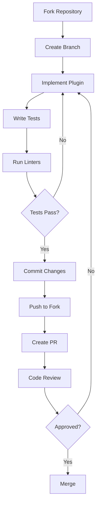

# Documentation Index

Welcome to the Checkmate documentation! This index will help you find the information you need.

## Getting Started

New to Checkmate? Start here:

1. **[README](../README.md)** - Project overview and setup instructions
2. **[Plugin Architecture](./plugin-architecture.md)** - Understand the core architecture
3. **[Contributing Guide](./contributing.md)** - Set up your development environment
4. **[Monorepo Tooling](./monorepo-tooling.md)** - Shared configurations and scripts

## Plugin Development

### Creating Plugins

- **[Backend Plugin Development](./backend-plugins.md)** - Build REST APIs, services, and database schemas
- **[Frontend Plugin Development](./frontend-plugins.md)** - Create UI components, pages, and routing
- **[Common Plugin Guidelines](./common-plugins.md)** - Share code between frontend and backend

### Advanced Features

- **[Extension Points](./extension-points.md)** - Implement pluggable strategies (health checks, exporters, notifications)
- **[Versioned Configurations](./versioned-configs.md)** - Manage schema evolution and migrations

## Architecture

### Core Concepts

- **[Plugin Architecture](./plugin-architecture.md)** - Pluggable architecture, IoC, and deployment options
- **[Monorepo Tooling](./monorepo-tooling.md)** - Shared configurations for TypeScript and package scripts
- **[Database Schema Isolation](./drizzle-schema-isolation.md)** - How each plugin gets its own database schema
- **[Dependency Linter](./dependency-linter.md)** - Enforced architecture rules and package types

### Package Types

| Type | Purpose | Documentation |
|------|---------|---------------|
| Backend | REST APIs, business logic, database | [Backend Plugins](./backend-plugins.md) |
| Frontend | UI components, pages, routing | [Frontend Plugins](./frontend-plugins.md) |
| Common | Shared types, permissions, constants | [Common Plugins](./common-plugins.md) |

## Quick Reference

### Backend Development

- [Quick Start](./backend-plugins.md#quick-start)
- [Plugin Registration API](./backend-plugins.md#plugin-registration-api)
- [Core Services](./backend-plugins.md#core-services)
- [Database Schema](./backend-plugins.md#database-schema)
- [Testing](./backend-plugins.md#testing)
- [Best Practices](./backend-plugins.md#best-practices)

### Frontend Development

- [Quick Start](./frontend-plugins.md#quick-start)
- [Client API Pattern](./frontend-plugins.md#client-api-pattern)
- [Permission Gating](./frontend-plugins.md#permission-gating)
- [UI Components](./frontend-plugins.md#ui-components)
- [Routing](./frontend-plugins.md#routing)
- [Best Practices](./frontend-plugins.md#best-practices)

### Extension Points

- [HealthCheckStrategy](./extension-points.md#healthcheckstrategy) - Custom health checks
- [ExporterStrategy](./extension-points.md#exporterstrategy) - Metrics and data export
- [NotificationStrategy](./extension-points.md#notificationstrategy) - Notification channels
- [AuthenticationStrategy](./extension-points.md#authenticationstrategy) - Auth providers
- [Frontend Slots](./extension-points.md#slots) - UI extension points

## Common Tasks

### Creating a New Plugin

1. Read [Plugin Architecture](./plugin-architecture.md) to understand the system
2. Run [Monorepo Tooling Sync](./monorepo-tooling.md#synchronization-tool) to setup configurations
3. Follow [Backend Plugin Guide](./backend-plugins.md#quick-start) to create backend
4. Follow [Frontend Plugin Guide](./frontend-plugins.md#quick-start) to create frontend
5. Create [Common Package](./common-plugins.md) for shared code
6. Write tests and documentation
7. Submit a PR following [Contributing Guide](./contributing.md#submitting-changes)

### Implementing a Health Check

1. Read [Extension Points](./extension-points.md#healthcheckstrategy)
2. Define your configuration schema with Zod
3. Implement the `execute` method
4. Register the strategy in your plugin
5. Test thoroughly

### Adding Permissions

1. Define permissions in [Common Package](./common-plugins.md#permission-export-pattern)
2. Register in [Backend Plugin](./backend-plugins.md#permission-patterns)
3. Use in [Frontend Components](./frontend-plugins.md#permission-gating)

### Schema Evolution

1. Read [Versioned Configurations](./versioned-configs.md)
2. Increment `configVersion`
3. Create migration function
4. Test migration with old data
5. Update schema and documentation

## Development Workflow

## Code Style

- **Language**: TypeScript (strict mode)
- **Tooling**: Standardized via [Monorepo Tooling](./monorepo-tooling.md)
- **Formatting**: Enforced by ESLint
- **Testing**: Bun test runner
- **Documentation**: JSDoc for public APIs

See [Contributing Guide](./contributing.md#code-style) for details.

## Architecture Rules

### Dependency Rules (Enforced)

- ✅ Common → Common only
- ✅ Frontend → Frontend or Common
- ✅ Backend → Backend or Common
- ❌ Common → Backend or Frontend
- ❌ Frontend → Backend

See [Dependency Linter](./dependency-linter.md) for enforcement details.

### Database Rules

- Each plugin gets isolated PostgreSQL schema
- No `pgSchema()` in table definitions
- Migrations run automatically
- Schema references are auto-fixed

See [Database Schema Isolation](./drizzle-schema-isolation.md) for details.

## Technology Stack

### Backend
- **Runtime**: Bun
- **Framework**: Hono
- **Database**: PostgreSQL + Drizzle ORM
- **Validation**: Zod
- **Testing**: Bun test

### Frontend
- **Framework**: React
- **Routing**: React Router DOM
- **UI**: ShadCN + Tailwind CSS
- **Build**: Vite
- **Testing**: Playwright

## Getting Help

- **Documentation**: You're reading it!
- **GitHub Issues**: Report bugs or request features
- **GitHub Discussions**: Ask questions or share ideas
- **Code Review**: Submit PRs for feedback

## Contributing

We welcome contributions! See the [Contributing Guide](./contributing.md) for:
- Development setup
- Code style guidelines
- Testing requirements
- PR submission process

## License

Checkmate is licensed under the [Elastic License 2.0](../LICENSE.md).

---

**Need help?** Check the [Contributing Guide](./contributing.md#getting-help) for support options.
