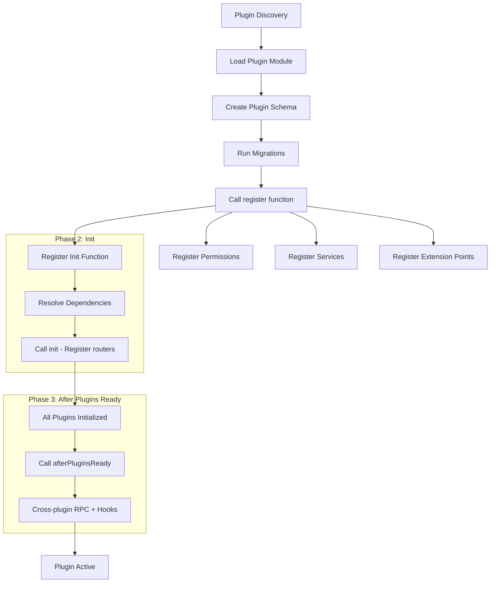
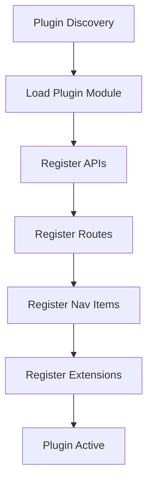
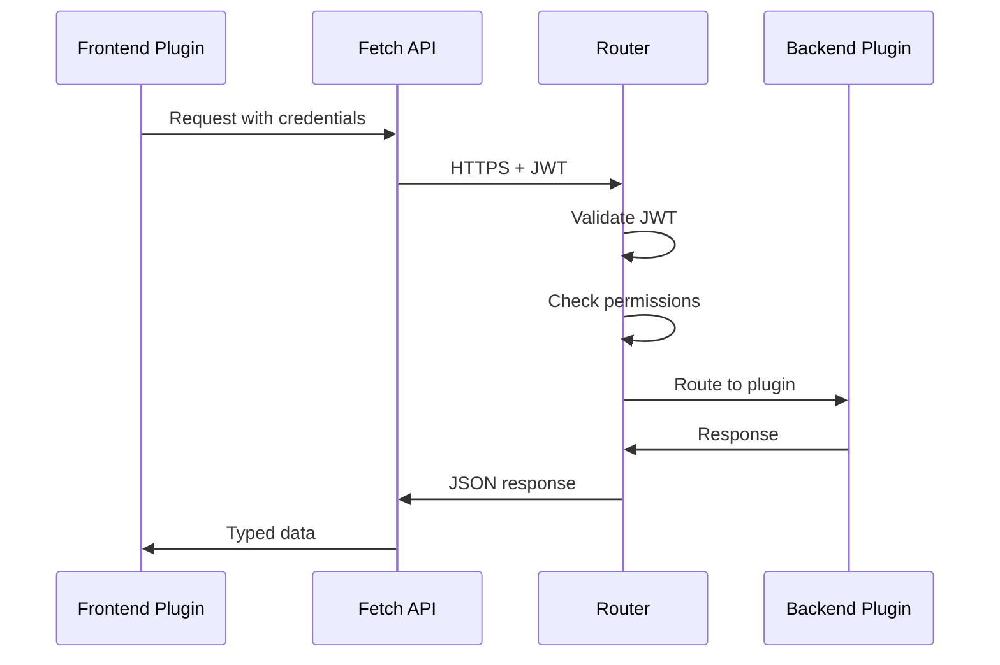
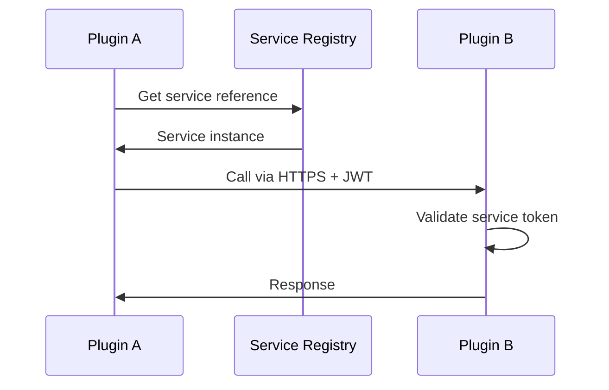

---
---
# Plugin Architecture Overview

## Introduction

Checkmate is built on a **pluggable architecture** that enables extensibility, modularity, and flexible deployment options. Everything beyond the core framework is implemented as a plugin, allowing the system to scale from monolithic deployments to distributed microservices.

## Core Principles

### 1. Runtime Registration

Plugins **MUST** be registerable at runtime. This design enables:
- Loading plugins from remote sources without code changes
- Hot-swapping plugins during development
- Dynamic feature enablement based on deployment needs

### 2. Inversion of Control (IoC)

Plugins register themselves with the core application through well-defined interfaces:
- **Backend plugins** register via `BackendPluginRegistry`
- **Frontend plugins** register via `FrontendPlugin` interface

The core calls plugin registration functions, not the other way around.

### 3. Secure Service-to-Service Communication

All plugin-to-plugin communication happens via:
- **HTTPS** for transport security
- **Signed JWTs** for authentication
- **Configured secrets** for token signing

This ensures security even in distributed deployments.

### 4. Modular Project Structure

Each plugin is a standalone npm package that can:
- Run independently
- Be deployed as part of a monolith
- Be deployed as a separate microservice
- Share code through common packages

## Project Structure

```
checkmate/
├── packages/
│   ├── backend/           # Core backend framework
│   ├── frontend/          # Core frontend framework
│   ├── backend-api/       # Backend plugin API
│   ├── frontend-api/      # Frontend plugin API
│   ├── common/            # Shared core types
│   └── ui/                # Shared UI components
│
└── plugins/
    ├── catalog-backend/
    ├── catalog-frontend/
    ├── catalog-common/
    ├── auth-backend/
    ├── auth-frontend/
    ├── healthcheck-backend/
    └── ...
```

## Package Types

Checkmate uses a strict package type system to maintain clean architecture:

| Package Type | Suffix/Pattern | Purpose | Can Depend On |
|--------------|---------------|---------|---------------|
| **Backend** | `-backend` | REST APIs, business logic, database | Backend packages, common packages |
| **Frontend** | `-frontend` | UI components, pages, routing | Frontend packages, common packages |
| **Common** | `-common` | Shared types, permissions, constants | Common packages only |
| **Node** | `-node` | Backend-only shared code | Backend packages, common packages |
| **React** | `-react` | Frontend-only shared components | Frontend packages, common packages |

### Dependency Rules

These rules are **automatically enforced** by the dependency linter:

- ✅ **Common** → Common only
- ✅ **Frontend** → Frontend or Common
- ✅ **Backend** → Backend or Common
- ❌ **Common** → Backend or Frontend (FORBIDDEN)
- ❌ **Frontend** → Backend (FORBIDDEN)

See [dependency-linter.md](../tooling/dependency-linter.md) for details.

## Plugin Lifecycle

### Backend Plugin Lifecycle

Backend plugins use a **two-phase initialization** to ensure cross-plugin communication works correctly:



> **Key Point:** The `init` function registers routers and services. The `afterPluginsReady` callback runs after ALL plugins have initialized, making it safe to:
> - Call other plugins via RPC
> - Subscribe to hooks (`onHook`)
> - Emit hooks (`emitHook`)

### Frontend Plugin Lifecycle



## Database Isolation

Each backend plugin gets its own **isolated PostgreSQL schema**:

```
Database: checkmate
├── Schema: public (core only)
├── Schema: plugin_catalog-backend
├── Schema: plugin_auth-backend
└── Schema: plugin_healthcheck-backend
```

### Benefits

- **Namespace isolation**: No table name conflicts
- **Independent migrations**: Each plugin manages its own schema
- **Security**: Plugins can't access each other's data directly
- **Scalability**: Easy to split into separate databases later

See [drizzle-schema-isolation.md](../backend/drizzle-schema.md) for implementation details.

## Extension Points

Extension points enable plugins to provide implementations for core functionality:

### Backend Extension Points

- **HealthCheckStrategy**: Implement custom health check methods
- **ExporterStrategy**: Export metrics and data in various formats
- **NotificationStrategy**: Send notifications via different channels
- **AuthenticationStrategy**: Integrate authentication providers

### Frontend Extension Points

- **Slots**: Inject UI components into predefined locations
- **Routes**: Add new pages to the application
- **APIs**: Provide client-side services

See [extension-points.md](../frontend/extension-points.md) for detailed documentation.

## Configuration Management

Plugins use **versioned configurations** to support backward compatibility:

```typescript
interface VersionedConfig<T> {
  version: number;
  pluginId: string;
  data: T;
  migratedAt?: Date;
  originalVersion?: number;
}
```

This enables:
- Schema evolution without breaking existing configs
- Automatic migration of old configurations
- Rollback support

See [versioned-configs.md](../backend/versioned-configs.md) for details.

## Communication Patterns

### Frontend ↔ Backend



### Backend ↔ Backend



## Permission System

Permissions are defined in common packages and registered by backend plugins:

```typescript
// In catalog-common
export const permissions = {
  entityRead: {
    id: "entity.read",
    description: "Read Systems and Groups",
  },
} satisfies Record<string, Permission>;

// In catalog-backend
env.registerPermissions(permissionList);

// In catalog-frontend
const canRead = permissionApi.usePermission(permissions.entityRead.id);
```

The core automatically prefixes permissions with the plugin ID: `catalog.entity.read`

## Technology Stack

### Backend
- **Runtime**: Bun
- **Framework**: Hono (HTTP routing)
- **Database**: PostgreSQL + Drizzle ORM
- **Validation**: Zod
- **Testing**: Bun test runner

### Frontend
- **Framework**: React
- **Routing**: React Router DOM
- **UI**: ShadCN + Tailwind CSS
- **Build**: Vite
- **Testing**: Playwright (E2E)

## Deployment Options

### Monolith (Default)

All plugins run in a single process:
```bash
bun run dev
```

### Microservices

Each plugin can run independently:
```bash
# Terminal 1
bun run dev:backend --plugins=catalog-backend

# Terminal 2
bun run dev:backend --plugins=auth-backend

# Terminal 3
bun run dev:frontend
```

### Hybrid

Mix and match based on scaling needs:
- Core + frequently-used plugins in monolith
- Resource-intensive plugins as separate services
- Geographic distribution for compliance

## Next Steps

- [Backend Plugin Development](../backend/plugins.md)
- [Frontend Plugin Development](../frontend/plugins.md)
- [Common Plugin Guidelines](../common/plugins.md)
- [Extension Points](../frontend/extension-points.md)
- [Versioned Configurations](../backend/versioned-configs.md)
- [Contributing Guide](../getting-started/contributing.md)
