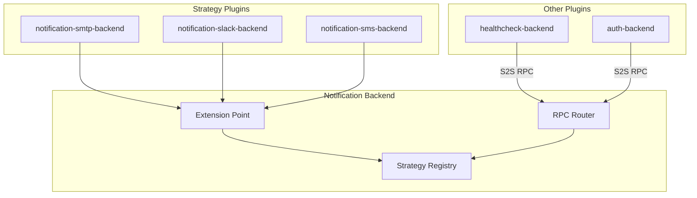
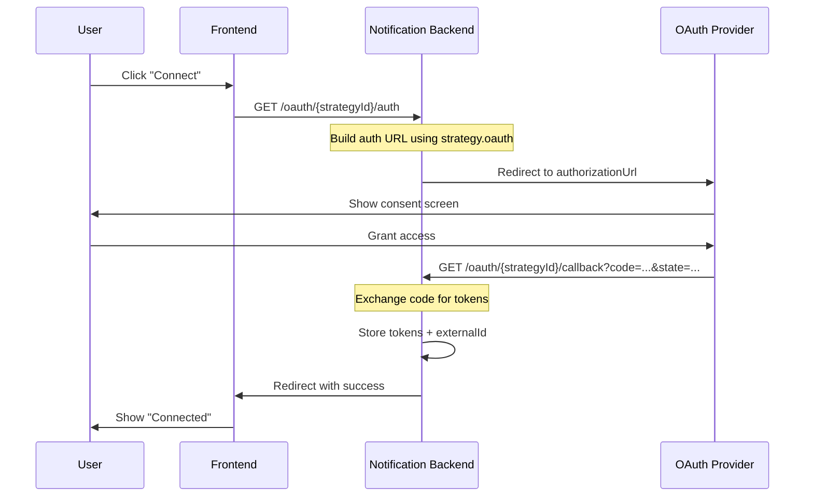

# Notification Strategies

The Notification Strategy system enables plugins to deliver notifications to users through external channels (email, Slack, Discord, SMS, etc.), extending beyond the platform's in-app notification system.

## Architecture Overview



## Core Concepts

### Namespaced Strategy IDs

Strategies are namespaced by their owning plugin's ID to prevent conflicts:

```typescript
// Plugin: notification-smtp-backend
// Strategy ID: smtp
// Qualified ID: notification-smtp.smtp
```

### Dynamic Access Rules

Each registered strategy automatically generates an access rule:

```
Format: {ownerPluginId}.strategy.{strategyId}.use
Example: notification-smtp.strategy.smtp.use
```

These access rules can be assigned to roles to control which users can receive notifications via specific channels.

### Contact Resolution

Strategies declare how they obtain user contact information:

| Type | Description | Example |
|------|-------------|---------|
| `auth-email` | Uses `user.email` from auth system | SMTP |
| `auth-provider` | Uses email from specific OAuth provider | Gmail-only notifications |
| `user-config` | User provides via settings form | SMS (phone number) |
| `oauth-link` | Requires OAuth flow | Slack, Discord |
| `custom` | Strategy handles resolution entirely | Custom integrations |

## Implementing a Strategy

### 1. Create Plugin Structure

```
plugins/notification-smtp-backend/
├── package.json
├── tsconfig.json
└── src/
    ├── plugin-metadata.ts
    └── index.ts
```

### 2. Define Configuration Schemas

Strategies can have up to three configuration layers:

```typescript
import { z } from "zod";
import { configString, configNumber, configBoolean, Versioned } from "@checkstack/backend-api";

// Infrastructure config (SMTP server, API keys)
const smtpConfigSchemaV1 = z.object({
  host: configString({}).describe("SMTP server hostname"),
  port: configNumber({}).default(587).describe("SMTP server port"),
  secure: configBoolean({}).default(false).describe("Use TLS/SSL"),
  username: configString({ "x-secret": true }).optional().describe("SMTP username"),
  password: configString({ "x-secret": true }).optional().describe("SMTP password"),
  fromAddress: configString({}).email().describe("Sender email address"),
  fromName: configString({}).optional().describe("Sender display name"),
});

// Layout config (admin-customizable branding)
const smtpLayoutConfigSchemaV1 = z.object({
  logoUrl: configString({}).url().optional().describe("Logo URL (max 200px wide)"),
  primaryColor: configString({ "x-color": true }).default("#3b82f6").describe("Primary brand color"),
  accentColor: configString({ "x-color": true }).optional().describe("Accent color for buttons"),
  footerText: configString({}).default("This is an automated notification.").describe("Footer text"),
});
```

> **💡 Tip:** Use `configString({ "x-color": true })` for hex color fields and `configString({ "x-secret": true })` for sensitive data. These render as specialized inputs in the admin UI (color picker, password field).

### 3. Implement the Strategy Interface

```typescript
import { 
  NotificationStrategy, 
  Versioned,
  markdownToHtml,
  markdownToPlainText,
  wrapInEmailLayout,
} from "@checkstack/backend-api";

const smtpStrategy: NotificationStrategy<SmtpConfig, undefined, SmtpLayoutConfig> = {
  id: "smtp",
  displayName: "Email (SMTP)",
  description: "Send notifications via email using SMTP",
  icon: "mail",

  config: new Versioned({ version: 1, schema: smtpConfigSchemaV1 }),
  layoutConfig: new Versioned({ version: 1, schema: smtpLayoutConfigSchemaV1 }),

  contactResolution: { type: "auth-email" },

  async send({ contact, notification, strategyConfig, layoutConfig }) {
    // Convert markdown body to HTML (see "Semantic Body" section below)
    const bodyHtml = notification.body ? markdownToHtml(notification.body) : "";
    const plainText = notification.body 
      ? markdownToPlainText(notification.body) 
      : notification.title;

    // Wrap in email layout with admin branding
    const html = wrapInEmailLayout({
      title: notification.title,
      bodyHtml,
      importance: notification.importance,
      action: notification.action,
      logoUrl: layoutConfig?.logoUrl,
      primaryColor: layoutConfig?.primaryColor,
      accentColor: layoutConfig?.accentColor,
      footerText: layoutConfig?.footerText,
    });

    await transporter.sendMail({
      from: strategyConfig.fromAddress,
      to: contact,
      subject: notification.title,
      text: plainText,
      html,
    });

    return { success: true };
  },
};
```

### 4. Register via Extension Point

```typescript
import { createBackendPlugin } from "@checkstack/backend-api";
import { notificationStrategyExtensionPoint } from "@checkstack/notification-backend";
import { pluginMetadata } from "./plugin-metadata";

export default createBackendPlugin({
  metadata: pluginMetadata,

  register(env) {
    const extensionPoint = env.getExtensionPoint(
      notificationStrategyExtensionPoint
    );

    extensionPoint.addStrategy(smtpStrategy, pluginMetadata);
  },
});
```

## Semantic Notification Body

Notifications use **semantic Markdown content** that strategies convert to their native format. This ensures content is authored once and renders appropriately across all channels.

### The Pattern

```typescript
// Plugin sending a notification
await notificationApi.notifyUsers({
  userIds: ["user-1"],
  notification: {
    title: "Health Check Failed",
    body: "**System:** api-server\n\nThe system is now in **degraded** state.\n\n[View Details](https://...)",
    importance: "critical",
    action: { label: "View Dashboard", url: "https://..." },
    type: "healthcheck.alert",
  },
});
```

### Conversion Utilities

The platform provides utilities for converting markdown to target formats:

| Utility | Output | Use Case |
|---------|--------|----------|
| `markdownToHtml()` | HTML | Email body content |
| `markdownToPlainText()` | Plain text | SMS, fallback content |
| `markdownToSlackMrkdwn()` | Slack mrkdwn | Slack messages |

```typescript
import { 
  markdownToHtml, 
  markdownToPlainText, 
  markdownToSlackMrkdwn 
} from "@checkstack/backend-api";

// Email strategy
const bodyHtml = markdownToHtml(notification.body);

// SMS strategy  
const bodyText = markdownToPlainText(notification.body);

// Slack strategy
const mrkdwn = markdownToSlackMrkdwn(notification.body);
```

### Action Rendering

The `action` field provides a semantic call-to-action:

| Strategy | Rendering |
|----------|-----------|
| Email | Styled button with label and URL |
| SMS | Appended as plain-text link |
| Slack | Block Kit button |
| Push | Deep link in notification tap |

## Layout Configuration

Rich-content strategies (email) can support admin-customizable layouts:

### Defining Layout Config

```typescript
const layoutConfigSchema = z.object({
  logoUrl: configString({}).url().optional().describe("Company logo URL"),
  primaryColor: configString({ "x-color": true }).default("#3b82f6").describe("Header/accent color"),
  accentColor: configString({ "x-color": true }).optional().describe("Button color"),
  footerText: configString({}).default("Sent by Checkstack").describe("Footer text"),
});

const strategy: NotificationStrategy<Config, undefined, LayoutConfig> = {
  // ...other fields
  layoutConfig: new Versioned({ version: 1, schema: layoutConfigSchema }),
};
```

### Using wrapInEmailLayout()

The `wrapInEmailLayout()` utility generates a responsive HTML email template:

```typescript
import { wrapInEmailLayout } from "@checkstack/backend-api";

const html = wrapInEmailLayout({
  title: notification.title,
  bodyHtml: markdownToHtml(notification.body),
  importance: notification.importance,  // Affects header color
  action: notification.action,          // Renders as button
  // Admin-configurable branding:
  logoUrl: layoutConfig.logoUrl,
  primaryColor: layoutConfig.primaryColor,
  accentColor: layoutConfig.accentColor,
  footerText: layoutConfig.footerText,
});
```

**Features:**
- Responsive design (works on mobile)
- Compatible with major email clients
- Importance-based default colors (blue/amber/red)
- Optional logo, customizable colors, footer links


## Strategy Interface

```typescript
interface NotificationStrategy<TConfig = unknown, TUserConfig = undefined, TLayoutConfig = undefined> {
  /** Strategy ID (namespace-qualified at runtime) */
  id: string;

  /** Display name for UI */
  displayName: string;

  /** Description */
  description?: string;

  /** Lucide icon name in PascalCase */
  icon?: LucideIconName;

  /** Admin configuration schema */
  config: Versioned<TConfig>;

  /** Per-user configuration schema (optional) */
  userConfig?: Versioned<TUserConfig>;

  /** Admin layout configuration schema (optional, for rich strategies like email) */
  layoutConfig?: Versioned<TLayoutConfig>;

  /** How contact info is resolved */
  contactResolution: NotificationContactResolution;

  /** Send a notification */
  send(
    context: NotificationSendContext<TConfig, TUserConfig, TLayoutConfig>
  ): Promise<NotificationDeliveryResult>;

  /** Declarative OAuth configuration (see "OAuth Integration" section) */
  oauth?: StrategyOAuthConfig<TConfig>;

  /** Markdown instructions for admins (displayed in config UI) */
  adminInstructions?: string;

  /** Markdown instructions for users (displayed when linking) */
  userInstructions?: string;
}
```

## OAuth Integration

Strategies that require OAuth linking (Slack, Discord, Microsoft Teams, etc.) can use the declarative `oauth` property. When provided, the notification-backend automatically registers all required HTTP endpoints and handles the complete OAuth flow.

### Automatic Endpoints

The platform registers these endpoints when a strategy has an `oauth` property:

| Endpoint | Method | Purpose |
|----------|--------|---------|
| `/api/notification/oauth/{strategyId}/auth` | GET | Initiate OAuth flow (redirect to provider) |
| `/api/notification/oauth/{strategyId}/callback` | GET | Handle OAuth callback from provider |
| `/api/notification/oauth/{strategyId}/refresh` | POST | Refresh expired tokens |
| `/api/notification/oauth/{strategyId}/unlink` | DELETE | Unlink user's account |

### StrategyOAuthConfig Interface

```typescript
interface StrategyOAuthConfig<TConfig = unknown> {
  /**
   * OAuth client ID.
   * Receives the strategy config so credentials can be extracted from admin settings.
   */
  clientId: (config: TConfig) => string;

  /**
   * OAuth client secret.
   * Receives the strategy config so credentials can be extracted from admin settings.
   */
  clientSecret: (config: TConfig) => string;

  /** Scopes to request from the OAuth provider */
  scopes: string[];

  /**
   * Authorization URL (where users are redirected to consent).
   * Receives config for tenant-specific URLs.
   */
  authorizationUrl: (config: TConfig) => string;

  /**
   * Token exchange URL.
   * Receives config for tenant-specific URLs.
   */
  tokenUrl: (config: TConfig) => string;

  /**
   * Extract the user's external ID from the token response.
   * This ID identifies the user on the external platform.
   */
  extractExternalId: (tokenResponse: Record<string, unknown>) => string;

  // Optional extractors (with sensible defaults)
  extractAccessToken?: (response: Record<string, unknown>) => string;
  extractRefreshToken?: (response: Record<string, unknown>) => string | undefined;
  extractExpiresIn?: (response: Record<string, unknown>) => number | undefined;

  // Optional customization
  encodeState?: (userId: string, returnUrl: string) => string;
  decodeState?: (state: string) => { userId: string; returnUrl: string };
  buildAuthUrl?: (params: { clientId: string; redirectUri: string; scopes: string[]; state: string }) => string;
  refreshToken?: (refreshToken: string) => Promise<{ accessToken: string; refreshToken?: string; expiresIn?: number }>;
}
```

### Example: Microsoft Teams Strategy

```typescript
import { z } from "zod";
import {
  NotificationStrategy,
  configString,
  Versioned,
  type StrategyOAuthConfig,
} from "@checkstack/backend-api";

const teamsConfigSchema = z.object({
  tenantId: configString({}).describe("Azure AD Tenant ID"),
  clientId: configString({}).describe("Azure AD Application (Client) ID"),
  clientSecret: configString({ "x-secret": true }).describe("Azure AD Client Secret"),
});

type TeamsConfig = z.infer<typeof teamsConfigSchema>;

const teamsStrategy: NotificationStrategy<TeamsConfig> = {
  id: "teams",
  displayName: "Microsoft Teams",
  description: "Send notifications via Microsoft Teams personal chat",
  icon: "MessageSquareMore",

  config: new Versioned({ version: 1, schema: teamsConfigSchema }),
  contactResolution: { type: "oauth-link" },

  // Declarative OAuth configuration
  oauth: {
    // Credentials extracted from admin-configured strategy config
    clientId: (config) => config.clientId ?? "",
    clientSecret: (config) => config.clientSecret ?? "",
    scopes: ["Chat.ReadWrite", "User.Read", "offline_access"],

    // Tenant-specific URLs
    authorizationUrl: (config) => {
      const tenantId = config.tenantId ?? "common";
      return `https://login.microsoftonline.com/${tenantId}/oauth2/v2.0/authorize`;
    },
    tokenUrl: (config) => {
      const tenantId = config.tenantId ?? "common";
      return `https://login.microsoftonline.com/${tenantId}/oauth2/v2.0/token`;
    },

    // Extract user's Microsoft object ID from the ID token
    extractExternalId: (response) => {
      const idToken = response.id_token as string | undefined;
      if (idToken) {
        const parts = idToken.split(".");
        if (parts.length === 3) {
          const payload = JSON.parse(Buffer.from(parts[1], "base64url").toString());
          if (payload.oid) return payload.oid;
        }
      }
      return (response.sub as string) ?? "";
    },
  } satisfies StrategyOAuthConfig<TeamsConfig>,

  async send(context) {
    // Access token is automatically provided via context for oauth-link strategies
    const { accessToken, externalId } = context as unknown as {
      accessToken?: string;
      externalId?: string;
    };

    // Use Microsoft Graph API to send notification...
    return { success: true };
  },
};
```

### Key Benefits

1. **No manual endpoint registration**: The platform handles `/auth`, `/callback`, `/refresh`, and `/unlink` endpoints automatically.

2. **Config-aware functions**: OAuth properties receive the strategy config, so credentials can be stored in admin settings rather than module-scoped variables.

3. **Tenant-specific URLs**: Functions like `authorizationUrl` and `tokenUrl` can dynamically construct URLs based on configuration (e.g., Azure AD tenant ID).

4. **Token management**: The platform stores tokens securely, handles refresh automatically, and provides them to `send()` via context.

5. **Type safety**: Using `satisfies StrategyOAuthConfig<TConfig>` ensures type-safe access to your config schema within OAuth functions.

### OAuth Flow Sequence



## Strategy Instructions

Strategies can provide markdown-formatted setup guides that display in the configuration UI:

### Admin Instructions

Shown when administrators configure the strategy in the global settings:

```typescript
const smtpStrategy: NotificationStrategy = {
  // ...
  adminInstructions: `
## SMTP Configuration

1. Enter your SMTP server **hostname** and **port**
2. Provide authentication credentials
3. Set the sender email address

> **Tip**: For Gmail, use \`smtp.gmail.com\` port 587.
`.trim(),
};
```

### User Instructions

Shown when users configure their personal settings (for `oauth-link` or `custom` contact resolution):

```typescript
const telegramStrategy: NotificationStrategy = {
  // ...
  contactResolution: { type: "custom" },
  userInstructions: `
## Connect Your Telegram Account

Click **Connect** to link your Telegram account.
`.trim(),
};

## User Preferences

Users can configure their notification preferences per strategy:

### Database Schema

```sql
CREATE TABLE user_notification_preferences (
  user_id TEXT NOT NULL,
  strategy_id TEXT NOT NULL,       -- Qualified: {pluginId}.{strategyId}
  config JSONB,                     -- User-specific config (validated via userConfig)
  enabled BOOLEAN DEFAULT true,     -- User can disable channel
  external_id TEXT,                 -- OAuth-linked external ID
  linked_at TIMESTAMP,
  PRIMARY KEY (user_id, strategy_id)
);
```

### Contact Resolution Flow

1. Strategy declares `contactResolution` type
2. Platform resolves contact based on type:
   - `auth-email`: Query user's email from auth system
   - `user-config`: Query from `userNotificationPreferences.config`
   - `oauth-link`: Query from `userNotificationPreferences.external_id`
3. Skip user if contact cannot be resolved

## S2S RPC Endpoints

Plugins send external notifications via S2S RPC:

```typescript
// Send to specific users via specific strategy
await notificationApi.sendExternal({
  userIds: ["user-1", "user-2"],
  strategyId: "notification-smtp.smtp", // optional, defaults to all enabled
  notification: {
    title: "Health Check Failed",
    description: "System 'api-server' is degraded",
    importance: "critical",
    type: "healthcheck.alert",
  },
});

// Send transactional message (bypasses user preferences)
await notificationApi.sendTransactional({
  userId: "user-1",
  strategyId: "notification-smtp.smtp",
  message: {
    title: "Password Reset",
    description: "Click the link to reset your password",
    type: "password-reset",
  },
});
```

## Best Practices

### 1. Use Versioned Configurations

Always use `Versioned<T>` for config schemas to support future migrations:

```typescript
const configV1 = z.object({ host: z.string() });
const configV2 = z.object({ host: z.string(), timeout: z.number() });

const migration: Migration<typeof configV1, typeof configV2> = {
  fromVersion: 1,
  toVersion: 2,
  description: "Add timeout field",
  migrate: (data) => ({ ...data, timeout: 30000 }),
};
```

### 2. Handle Errors Gracefully

Return descriptive error messages for debugging:

```typescript
async send(context) {
  try {
    await sendEmail(context);
    return { success: true };
  } catch (error) {
    return {
      success: false,
      error: error instanceof Error ? error.message : "Unknown error",
    };
  }
}
```

### 3. Use Factory Functions for Specialized Fields

Use platform factory functions for specialized UI and validation:

```typescript
import { configString } from "@checkstack/backend-api";

const config = z.object({
  // Secrets: rendered as password inputs, encrypted at rest
  apiKey: configString({ "x-secret": true }).describe("API key for service"),
  
  // Colors: rendered as color picker, validated as hex
  brandColor: configString({ "x-color": true }).default("#3b82f6").describe("Primary brand color"),
  accentColor: configString({ "x-color": true }).optional().describe("Optional accent"),
});
```

### 4. Convert Markdown to Native Formats

Always use the platform utilities for converting notification body content:

```typescript
import { markdownToHtml, markdownToPlainText } from "@checkstack/backend-api";

// Rich content (email)
const html = markdownToHtml(notification.body);

// Plain text (SMS, plain text email fallback)
const text = markdownToPlainText(notification.body);
```

### 5. Use Email Layout Wrapper

For email strategies, use `wrapInEmailLayout()` for consistent, responsive emails:

```typescript
import { wrapInEmailLayout } from "@checkstack/backend-api";

const html = wrapInEmailLayout({
  title: notification.title,
  bodyHtml: markdownToHtml(notification.body),
  importance: notification.importance,
  action: notification.action,
  ...layoutConfig,  // Admin branding
});
```

### 6. Provide User-Friendly Icons

Use Lucide icon names for consistent UI:

```typescript
const strategy = {
  icon: "mail",        // SMTP
  icon: "slack",       // Slack
  icon: "phone",       // SMS
  icon: "message-circle", // Generic messaging
};
```

## See Also

- [Plugin Development](./plugins.md)
- [Configuration Service](./config-service.md)
- [Versioned Configs](./versioned-configs.md)
- [Config Schemas (Frontend)](../frontend/config-schemas.md)
- [Signals](./signals.md)
