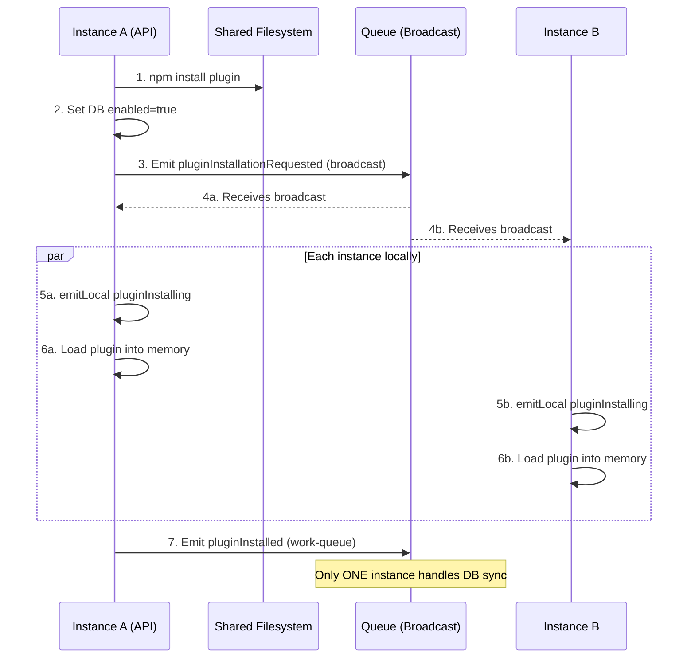
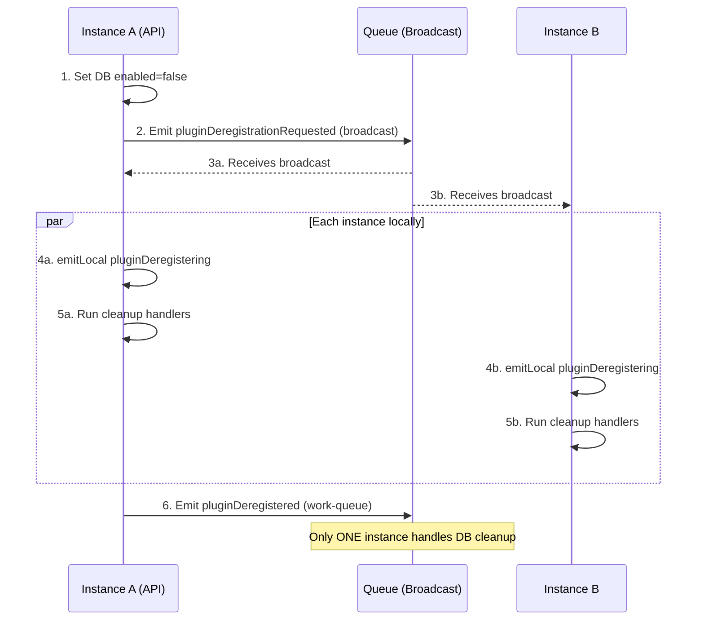

---
---
# Backend Plugin Development Guide

## Overview

Backend plugins provide type-safe RPC APIs, business logic, database schemas, and integration with external services. They are built using **oRPC** for contract implementation, **Drizzle** for database access, and **Zod** for validation.

The backend implements contracts defined in `-common` packages, ensuring end-to-end type safety from database to frontend.

## Quick Start

### 1. Scaffold Plugin with CLI

The fastest way to create a backend plugin is using the CLI scaffolding tool:

```bash
bun run create
```

**Interactive prompts:**
1. Select `backend` as the plugin type
2. Enter your plugin name (e.g., `myfeature`)
3. Provide a description (optional)
4. Confirm to generate

This will create a complete plugin structure with:
- ✅ Package configuration with all required dependencies
- ✅ TypeScript configuration
- ✅ Drizzle database schema template
- ✅ oRPC router with access middleware
- ✅ Service layer with CRUD operations
- ✅ Plugin registration
- ✅ Initial changeset for version management

**Generated structure:**
```
plugins/myfeature-backend/
├── .changeset/
│   └── initial.md              # Version changeset
├── drizzle.config.ts           # Drizzle Kit configuration
├── package.json                # Dependencies
├── tsconfig.json               # TypeScript config
├── README.md                   # Documentation
└── src/
    ├── index.ts                # Plugin entry point
    ├── router.ts               # oRPC router implementation
    ├── service.ts              # Business logic layer
    └── schema.ts               # Drizzle database schema
```

### 2. Install Dependencies

```bash
cd plugins/myfeature-backend
bun install
```

### 3. Customize Your Plugin

The generated plugin is a fully functional example. Customize it for your domain:

#### Update Database Schema

**src/schema.ts:**

```typescript
import { pgTable, text, timestamp, uuid } from "drizzle-orm/pg-core";

export const myItems = pgTable("items", {
  id: uuid("id").primaryKey().defaultRandom(),
  name: text("name").notNull(),
  description: text("description"),
  createdAt: timestamp("created_at").notNull().defaultNow(),
  updatedAt: timestamp("updated_at").notNull().defaultNow(),
});
```

#### Generate Migration

After modifying the schema:

```bash
bun run drizzle-kit generate
```

This creates a migration in the `migrations/` directory.

### 4. Implement Business Logic

The generated service layer provides a starting point. Extend it with your domain logic:

**src/service.ts:**

```typescript
export class MyFeatureService {
  constructor(private readonly database: Database) {}

  async getItems() {
    return await this.database.select().from(myItems);
  }

  async createItem(data: CreateMyItem) {
    // Add custom validation or business logic
    const [item] = await this.database
      .insert(myItems)
      .values({
        name: data.name,
        description: data.description ?? null,
      })
      .returning();

    return item;
  }

  // Add your custom methods here
}
```

### 5. Update Router Procedures

The router implements the contract from your common package using the contract-based approach:

**src/router.ts:**

```typescript
import { implement } from "@orpc/server";
import { autoAuthMiddleware, type RpcContext } from "@checkstack/backend-api";
import { myFeatureContract } from "@checkstack/myfeature-common";

/**
 * Create the router using contract-based implementation.
 * Auth and access rules are automatically enforced via autoAuthMiddleware
 * based on the contract's meta.userType and meta.access.
 */
const os = implement(myFeatureContract)
  .$context<RpcContext>()
  .use(autoAuthMiddleware);

export function createMyFeatureRouter({ database }: { database: Database }) {
  const service = new MyFeatureService(database);

  return os.router({
    // Handler names must match the contract procedure names
    getItems: os.getItems.handler(async () => {
      return await service.getItems();
    }),

    createItem: os.createItem.handler(async ({ input }) => {
      return await service.createItem(input);
    }),

    // Add more handlers matching your contract
  });
}
```

### 6. Verify and Test

```bash
# Type check
bun run typecheck

# Lint
bun run lint

# Run tests
bun test
```

That's it! Your backend plugin is ready to use.

> **Note:** Don't forget to also create the corresponding `-common` package to define your contract. See [Common Plugin Guidelines](../common/plugins.md) for details.

## Plugin Registration API

### `createBackendPlugin(config)`

Creates a backend plugin with the specified configuration.

**Parameters:**
- `metadata` (PluginMetadata): Plugin metadata object containing `pluginId`
- `register` (function): Registration function called by the core

### Registration Environment (`env`)

The `register` function receives an environment object with these methods:

#### `env.registerAccessRules(accessRules: AccessRule[])`

Register access rules that this plugin provides.

```typescript
env.registerAccessRules([
  { id: "item.read", description: "Read items", isDefault: true },
  { id: "item.manage", description: "Manage items" },
]);
```

> **Note**: The core automatically prefixes access rule IDs with the plugin ID.
> `item.read` becomes `myplugin.item.read`

##### Access Rule Options

| Field | Type | Description |
|-------|------|-------------|
| `id` | `string` | Unique access rule identifier (auto-prefixed with plugin ID) |
| `description` | `string?` | Human-readable description |
| `isDefault` | `boolean?` | If `true`, access rule is auto-assigned to the "users" role |

##### Default Access Rules and the "Users" Role

The platform has a built-in **"users"** system role that is automatically assigned to newly registered users. Access rules marked with `isDefault: true` are automatically synced to this role during backend startup.

**How it works:**

1. On startup, the `auth-backend` collects all access rules from all plugins
2. Access rules with `isDefault: true` are synced to the "users" role
3. Administrators can still manually remove default access rules from the "users" role
4. Removed defaults are tracked in the `disabled_default_access_rule` table
5. Re-adding a default access rule via the admin UI clears the disabled flag

**Example:**

```typescript
// In your access rules definition
export const access = {
  // This access rule will be auto-assigned to all new users
  itemRead: { 
    id: "item.read", 
    description: "Read items",
    isDefault: true  // ✅ Granted to "users" role
  },
  // This access rule requires manual role assignment
  itemManage: { 
    id: "item.manage", 
    description: "Manage items" 
    // isDefault: false by default
  },
} as const satisfies Record<string, AccessRule>;
```

**System Roles:**

| Role | Type | Description |
|------|------|-------------|
| `admin` | System | Wildcard access to all access rules. Cannot delete. Access rules not editable. |
| `users` | System | Auto-assigned to new users. Default access rules synced here. Cannot delete. |

> **See also:** For resource-level access control (restricting access to specific systems, health checks, etc.), see [Teams and Resource-Level Access Control](./teams.md).

#### `env.registerInit(config)`

Register the plugin's initialization function.

**Config:**
- `schema`: Drizzle schema object (optional)
- `deps`: Dependencies to inject
- `init`: Async initialization function (Phase 2)
- `afterPluginsReady`: Async function called after all plugins initialized (Phase 3, optional)

```typescript
import { OtherApi } from "@checkstack/other-common";

env.registerInit({
  schema: mySchema,
  deps: {
    rpc: coreServices.rpc,
    logger: coreServices.logger,
    rpcClient: coreServices.rpcClient,
  },
  // Phase 2: Register routers and services
  // DO NOT make RPC calls to other plugins here
  init: async ({ database, rpc, logger }) => {
    const router = createMyRouter(database);
    rpc.registerRouter(router);  // No plugin ID needed - auto-detected from metadata
  },
  // Phase 3: Called after ALL plugins are initialized
  // Safe to make RPC calls and subscribe to hooks
  afterPluginsReady: async ({ database, rpcClient, onHook, emitHook }) => {
    // Call other plugins via RPC using their Api definition
    const otherClient = rpcClient.forPlugin(OtherApi);
    await otherClient.someMethod({ ... });
    
    // Subscribe to hooks
    onHook(coreHooks.someEvent, async (payload) => {
      // Handle event
    });
  },
});
```

## Hooks and Events

The platform provides a distributed hook/event system for cross-plugin communication. Hooks are delivered via the queue system for reliable multi-instance support.

### Hook Modes

| Mode | Description | Use Case |
|------|-------------|----------|
| `broadcast` (default) | All instances receive and process | UI updates, config changes |
| `work-queue` | Only one instance processes (load-balanced) | DB writes, external API calls |
| `instance-local` | In-memory only, not distributed | Cleanup hooks, shutdown |

### Subscribing to Hooks

```typescript
afterPluginsReady: async ({ onHook }) => {
  // Broadcast mode (default) - all instances receive
  onHook(coreHooks.configUpdated, async ({ pluginId, key, value }) => {
    // Handle config change
  });

  // Work-queue mode - only one instance handles
  onHook(
    coreHooks.accessRulesRegistered,
    async ({ pluginId, accessRules }) => {
      // Sync to database
    },
    {
      mode: "work-queue",
      workerGroup: "access-rule-sync", // Namespaced automatically
      maxRetries: 5,
    }
  );

  // Instance-local mode - not distributed
  onHook(
    coreHooks.pluginDeregistering,
    async ({ pluginId, reason }) => {
      // Cleanup local resources
    },
    { mode: "instance-local" }
  );
}
```

### Emitting Hooks

```typescript
afterPluginsReady: async ({ emitHook }) => {
  // Regular emit (distributed via queue)
  await emitHook(coreHooks.configUpdated, {
    pluginId: "my-plugin",
    key: "apiKey",
    value: "new-value",
  });
}
```

### Core Hooks Reference

| Hook | Payload | Description |
|------|---------|-------------|
| `accessRulesRegistered` | `{ pluginId, accessRules }` | Plugin registered access rules |
| `configUpdated` | `{ pluginId, key, value }` | Configuration changed |
| `pluginInitialized` | `{ pluginId }` | Plugin completed init (Phase 2) |
| **Installation** | | |
| `pluginInstallationRequested` | `{ pluginId, pluginPath }` | Installation broadcast |
| `pluginInstalling` | `{ pluginId }` | **LOCAL**: Loading on THIS instance |
| `pluginInstalled` | `{ pluginId }` | Plugin fully loaded |
| **Deregistration** | | |
| `pluginDeregistrationRequested` | `{ pluginId, deleteSchema }` | Deregistration broadcast |
| `pluginDeregistering` | `{ pluginId, reason }` | **LOCAL**: Cleanup on THIS instance |
| `pluginDeregistered` | `{ pluginId }` | Plugin fully removed |
| **Lifecycle** | | |
| `platformShutdown` | `{ reason }` | Platform shutting down |

### Multi-Instance Installation Flow

When a plugin is installed at runtime in a multi-instance setup:



### Multi-Instance Deregistration Flow

When a plugin is deregistered in a multi-instance setup:



### Registering Cleanup Handlers

Plugins can register cleanup logic that runs when deregistered:

```typescript
register: (env) => {
  // Register cleanup handler (runs LIFO on deregistration)
  env.registerCleanup(async () => {
    // Cancel recurring jobs, close connections, etc.
    await myQueue.cancelRecurring("my-job");
  });
}
```

#### `env.registerService<S>(ref: ServiceRef<S>, impl: S)`

Register a service that other plugins can use.

```typescript
const myServiceRef = createServiceRef<MyService>("my-service");

env.registerService(myServiceRef, {
  doSomething: async () => {
    // Implementation
  },
});
```

#### `env.registerExtensionPoint<T>(ref: ExtensionPoint<T>, impl: T)`

Register an implementation for an extension point.

```typescript
import { healthCheckExtensionPoint } from "@checkstack/backend-api";

env.registerExtensionPoint(healthCheckExtensionPoint, {
  id: "http-check",
  displayName: "HTTP Health Check",
  execute: async (config) => {
    // Implementation
  },
});
```

## Core Services

The core provides these services via `coreServices`:

### `coreServices.rpc`

The RPC service for registering oRPC routers.

**Routers are automatically mounted at:** `/api/<pluginId>/`

```typescript
const router = createMyPluginRouter(database);
rpc.registerRouter(router);  // Plugin ID auto-detected from metadata
// Procedures accessible at: /api/myplugin/<procedureName>
```

> **Critical**: The registration name must match the plugin ID exactly for frontend clients to work correctly.

### `coreServices.logger`

Structured logging service.

```typescript
logger.info("Informational message");
logger.warn("Warning message");
logger.error("Error message");
logger.debug("Debug message");
```

## Contract Implementation Pattern

### 1. Define Contract in Common Package

Contracts are defined in the `-common` package using `@orpc/contract`. See [Common Plugin Guidelines](../common/plugins.md) for details.

### 2. Implement Contract in Backend

The backend router implements the contract using the **contract-based approach** with `implement()` and `autoAuthMiddleware`:

```typescript
import { implement } from "@orpc/server";
import { autoAuthMiddleware, type RpcContext } from "@checkstack/backend-api";
import { myPluginContract, accessRuleList } from "@checkstack/myplugin-common";

/**
 * Creates the router using contract-based implementation.
 * Auth and access rules are automatically enforced via autoAuthMiddleware
 * based on the contract's meta.userType and meta.access.
 */
const os = implement(myPluginContract)
  .$context<RpcContext>()
  .use(autoAuthMiddleware);

export const createMyPluginRouter = (database: Database) => {
  return os.router({
    // Handler names must match contract procedure names
    getItems: os.getItems.handler(async () => {
      // Auth and access rules auto-enforced from contract meta
      // Implementation
    }),
  });
};
```

### 3. Contract-Driven Security

The project uses **contract-driven security enforcement**:

- **Contracts declare** auth requirements via `.meta({ userType: "user", access: [...] })`
- **autoAuthMiddleware** automatically enforces these requirements at runtime

This pattern ensures security is:
- **Self-documenting**: Requirements visible in the contract
- **Automatically enforced**: No manual middleware chaining needed
- **Type-safe**: Contract meta determines context.user type

```typescript
// In contract (declaration AND enforcement):
import type { ProcedureMetadata } from "@checkstack/common";

const _base = oc.$meta<ProcedureMetadata>({});

export const myPluginContract = {
  // Requires authenticated user with specific access
  getItems: _base
    .meta({ userType: "user", access: [access.itemRead.id] })
    .output(z.array(ItemSchema)),

  // Public endpoint (no auth required)
  getPublicInfo: _base
    .meta({ userType: "anonymous" })
    .output(z.object({ version: z.string() })),

  // Service-to-service endpoint
  internalSync: _base
    .meta({ userType: "service" })
    .output(z.void()),
};
```

### 4. userType Options

| Value | Description |
|-------|-------------|
| `"anonymous"` | No authentication required (public endpoints) |
| `"user"` | Only real users (frontend authenticated) |
| `"service"` | Only services (backend-to-backend) |
| `"authenticated"` | Either users or services, but must be authenticated (default) |

### 5. Handler Type Inference

oRPC automatically infers types from the procedure chain. **Do not** add explicit type annotations to handler parameters.

```typescript
// ✅ Good - Let oRPC infer types
.handler(async ({ input, context }) => {
  // input and context are automatically typed
})

// ❌ Bad - Don't add complex type annotations
.handler(async ({ input, context }: { input: SomeType; context: SomeContext }) => {
  // This breaks inference
})
```

### 6. Contract-Level instanceAccess Override

When you have both single-resource and bulk endpoints that share the same permission but need different access control configurations, use the `instanceAccess` override at the contract level.

**Why?** Access rules can have an `instanceAccess` config (like `idParam` for single resources or `recordKey` for bulk). Instead of creating duplicate access rules, you can override this at the contract level.

**Example:**

```typescript
import { proc, accessPair } from "@checkstack/common";

// Define access rule with idParam (for single resource endpoints)
export const incidentAccess = {
  incident: accessPair(
    "incident",
    {
      read: {
        description: "View incidents",
        isDefault: true,
        isPublic: true,
      },
      manage: {
        description: "Manage incidents",
      },
    },
    {
      idParam: "systemId",  // Single resource check
    }
  ),
};

export const incidentContract = {
  // Single endpoint - uses access rule's idParam
  getIncidentsForSystem: proc({
    operationType: "query",
    userType: "public",
    access: [incidentAccess.incident.read],
  })
    .input(z.object({ systemId: z.string() }))
    .output(z.array(IncidentSchema)),

  // Bulk endpoint - overrides to use recordKey
  getBulkIncidentsForSystems: proc({
    operationType: "query",
    userType: "public",
    access: [incidentAccess.incident.read],  // Same access rule
    instanceAccess: { recordKey: "incidents" },  // Override for bulk
  })
    .input(z.object({ systemIds: z.array(z.string()) }))
    .output(z.object({ incidents: z.record(z.string(), z.array(IncidentSchema)) })),
};
```


**Benefits:**
- ✅ Single access rule for both single and bulk endpoints
- ✅ No duplicate access rules in the UI
- ✅ Same permission governs both endpoint types
- ✅ Clear separation between authorization (access rule) and filtering strategy (instanceAccess)

**instanceAccess Options:**

| Field | Type | Use Case |
|-------|------|----------|
| `idParam` | `string` | Single resource: Check access to specific resource ID from input |
| `listKey` | `string` | List filtering: Filter output array by accessible resources |
| `recordKey` | `string` | Record filtering: Filter output record by accessible resource keys |

## Database Schema

### Configuration vs User Data

**Important:** Distinguish between **plugin configuration** and **user data**:

- **Plugin Configuration**: Use `ConfigService` for settings that control plugin behavior
  - Examples: Active queue provider, enabled auth strategies, API keys
  - See [Configuration Storage Guide](./config-service.md) for details

-  **User Data**: Use custom Drizzle schemas for user-created content
  - Examples: Health check instances, catalog systems, user-created items
  - Define schema in `src/schema.ts` as shown below

> **When in doubt**: Ask "Is this controlling the plugin's behavior, or is it content users create?"  
> Behavior → ConfigService | Content → Custom schema

### Define Schema

**src/schema.ts:**

```typescript
import { pgTable, text, timestamp } from "drizzle-orm/pg-core";

export const items = pgTable("items", {
  id: text("id").primaryKey(),
  name: text("name").notNull(),
  description: text("description"),
  createdAt: timestamp("created_at").defaultNow().notNull(),
  updatedAt: timestamp("updated_at").defaultNow().notNull(),
});
```

### TypeScript Configuration

Backend plugins should extend the shared backend configuration.

**tsconfig.json:**

```json
{
  "extends": "@checkstack/tsconfig/backend.json",
  "include": ["src"]
}
```

See [Monorepo Tooling](../tooling/cli.md) for more information.

### Configure Drizzle

**drizzle.config.ts:**

```typescript
import { defineConfig } from "drizzle-kit";

export default defineConfig({
  schema: "./src/schema.ts",
  dialect: "postgresql",
  out: "./drizzle",
});
```

### Generate Migrations

```bash
bun run drizzle-kit generate
```

This creates migration files in `./drizzle/`.

### Automatic Migration

The core **automatically runs migrations** when the plugin loads. No manual migration step needed!

See [drizzle-schema-isolation.md](./drizzle-schema.md) for details.

## Router Factory Pattern

Routers should be created as factory functions that accept the plugin-scoped database instance:

```typescript
export const createMyPluginRouter = (
  database: NodePgDatabase<typeof schema>
) => {
  return os.router({
    // Procedures use the captured database, NOT context.db
  });
};
```

**Why?** The `context.db` in oRPC handlers is the admin database pool. Plugin tables are isolated in schemas like `plugin_<id>`, so using `context.db` will result in "relation does not exist" errors.

**Solution:** Capture the plugin-scoped database via the factory pattern and use it in all handlers.

## Dependency Injection

### Declaring Dependencies

```typescript
env.registerInit({
  deps: {
    rpc: coreServices.rpc,
    logger: coreServices.logger,
    myService: myServiceRef,
  },
  init: async ({ database, rpc, logger, myService }) => {
    // All dependencies are resolved and typed
  },
});
```

### Type Safety

Dependencies are fully typed. TypeScript will error if:
- You declare a dependency that doesn't exist
- You use a dependency with the wrong type
- You forget to declare a dependency you use

## Testing

### Router Tests

**src/router.test.ts:**

```typescript
import { describe, it, expect, mock } from "bun:test";
import { createMyPluginRouter } from "./router";
import { createMockRpcContext } from "@checkstack/backend-api";
import { call } from "@orpc/server";

describe("MyPlugin Router", () => {
  // 1. Create a mock database instance
  const mockDb = {
    select: mock().mockReturnValue({
      from: mock().mockReturnValue([
        { id: "1", name: "Test Item", description: null },
      ]),
    }),
  } as any;

  // 2. Initialize the router with the mock database
  const router = createMyPluginRouter(mockDb);

  it("getItems returns items", async () => {
    const context = createMockRpcContext({
      user: { id: "test-user", roles: ["admin"] },
    });

    // 3. Use 'call' from @orpc/server to execute the procedure
    const result = await call(router.getItems, undefined, { context });

    expect(Array.isArray(result)).toBe(true);
    expect(mockDb.select).toHaveBeenCalled();
  });
});
```

### Service Tests

**src/service.test.ts:**

```typescript
import { describe, expect, test, beforeEach } from "bun:test";
import { drizzle } from "drizzle-orm/node-postgres";
import { Pool } from "pg";
import * as schema from "./schema";
import { ItemService } from "./service";

describe("ItemService", () => {
  let db: ReturnType<typeof drizzle>;
  let service: ItemService;

  beforeEach(async () => {
    const pool = new Pool({
      connectionString: process.env.TEST_DATABASE_URL,
    });
    db = drizzle(pool, { schema });
    service = new ItemService(db);

    // Clean up
    await db.delete(schema.items);
  });

  test("creates item", async () => {
    const item = await service.createItem({
      name: "Test Item",
      description: "Test Description",
    });

    expect(item.name).toBe("Test Item");
    expect(item.id).toBeDefined();
  });
});
```

### Integration Tests

Test plugin registration and initialization:

```typescript
import { describe, expect, test } from "bun:test";
import plugin from "./index";

describe("MyPlugin Backend", () => {
  test("exports plugin", () => {
    expect(plugin.pluginId).toBe("myplugin");
    expect(plugin.register).toBeFunction();
  });
});
```

## Best Practices

### 1. Use Services for Business Logic

Don't put business logic directly in procedure handlers:

```typescript
// ❌ Bad
getItems: os.getItems.handler(async () => {
  const items = await database.select().from(schema.items);
  return items;
}),

// ✅ Good
getItems: os.getItems.handler(async () => {
  return await itemService.getItems();
}),
```

### 2. Generate IDs Server-Side

Never require IDs from the frontend. Generate them in the service layer:

```typescript
async createItem(data: NewItem) {
  const [item] = await this.database
    .insert(schema.items)
    .values({
      id: uuidv4(), // Generate ID internally
      ...data
    })
    .returning();
  return item;
}
```

### 3. Use Type Assertions for JSON Fields

Drizzle's `json()` columns infer to `unknown`. Use type assertions to bridge to your contract types:

```typescript
.handler(async () => {
  const result = await service.getItems();
  return result as unknown as Array<typeof result[number] & {
    metadata: Record<string, unknown> | null
  }>;
});
```

### 4. Log Important Events

```typescript
logger.info("Item created", { itemId: item.id });
logger.warn("Item not found", { itemId: id });
logger.error("Failed to create item", { error: err.message });
```

### 5. Write Tests

Test all services and critical paths:

```bash
bun test
```

## Troubleshooting

### 404 Errors

If your oRPC endpoints return 404:

1. Verify router is registered with `rpc.registerRouter`
2. Ensure registration name exactly matches the plugin ID
3. Check plugin initialization is executed (check backend logs)
4. Verify frontend client uses matching plugin ID

### 500 Errors

If your oRPC endpoints return 500 after routing is fixed:

1. **Missing Database Migrations**: Check backend logs for "relation does not exist"
2. **Context Database**: Ensure handlers use the captured plugin-scoped database, NOT `context.db`
3. **Validation Errors**: Check that service layer returns data matching the contract output schema

### Type Errors in Handlers

If TypeScript complains about handler types:

1. Remove explicit type annotations from handler parameters
2. Let oRPC infer types from the procedure chain
3. Ensure input/output schemas match the contract definition

## Next Steps

- [Configuration Storage](./config-service.md) - When to use ConfigService vs custom schemas
- [Health Check Strategies](./healthcheck-strategies.md) - Transport strategy development
- [Collector Plugins](./collectors.md) - Extend strategies with diagnostic collectors
- [Frontend Plugin Development](../frontend/plugins.md)
- [Common Plugin Guidelines](../common/plugins.md)
- [Extension Points](../frontend/extension-points.md)
- [Versioned Configurations](./versioned-configs.md)

