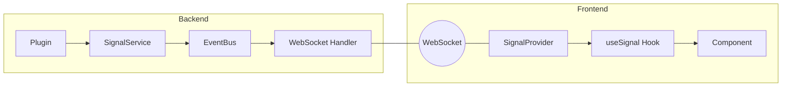
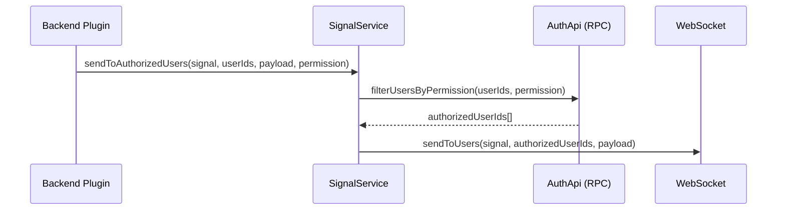
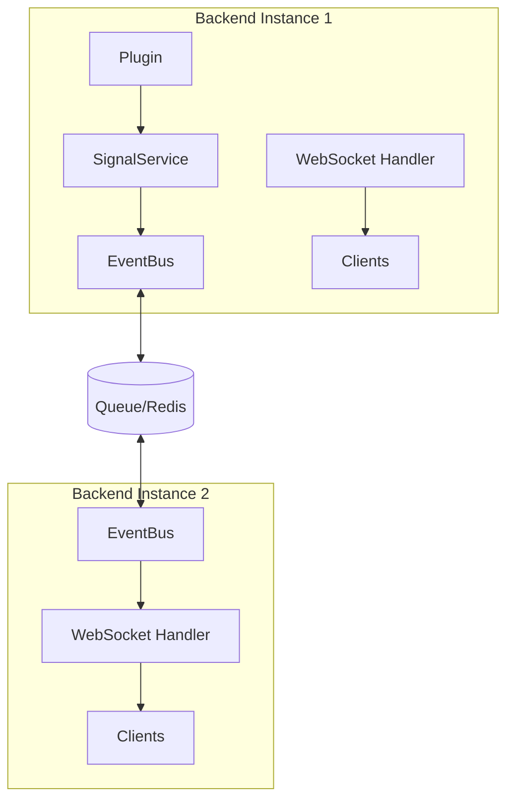

---
---
# Signal Service Architecture

The Signal Service provides realtime backend-to-frontend communication via WebSockets. It enables plugins to push typed events to connected clients, replacing polling mechanisms with instant updates.

## Overview



### Key Features

- **Type-safe signals** with Zod schema validation
- **Multi-instance coordination** via EventBus (works across backend replicas)
- **Broadcast channels** for all clients (anonymous allowed)
- **User-specific channels** for private messages (authentication required)
- **Automatic reconnection** with exponential backoff

---

## Packages

| Package | Purpose |
|---------|---------|
| `@checkmate-monitor/signal-common` | Shared types, `Signal` interface, `createSignal()` factory |
| `@checkmate-monitor/signal-backend` | `SignalServiceImpl`, WebSocket handler for Bun |
| `@checkmate-monitor/signal-frontend` | React `SignalProvider` and `useSignal()` hook |

---

## Defining Signals

Signals are defined in `-common` packages using `createSignal()`:

```typescript
import { createSignal } from "@checkmate-monitor/signal-common";
import { z } from "zod";

export const NOTIFICATION_RECEIVED = createSignal(
  "notification.received",
  z.object({
    id: z.string(),
    title: z.string(),
    description: z.string(),
    importance: z.enum(["info", "warning", "critical"]),
  })
);
```

### Signal ID Naming Convention

Use dot-notation: `{domain}.{action}`

Examples:
- `notification.received`
- `notification.countChanged`
- `healthcheck.statusChanged`
- `system.maintenanceScheduled`

---

## Backend Usage

### Accessing SignalService

The `SignalService` is available via `coreServices`:

```typescript
import { coreServices } from "@checkmate-monitor/backend-api";

// In a plugin init
const signalService = await services.get(coreServices.signalService);
```

### Emitting Signals

#### Broadcast (All Clients)

```typescript
import { SYSTEM_MAINTENANCE } from "@checkmate-monitor/system-common";

// All connected clients receive this
await signalService.broadcast(SYSTEM_MAINTENANCE, {
  message: "System maintenance in 5 minutes",
  scheduledAt: new Date().toISOString(),
});
```

#### To Specific User

```typescript
import { NOTIFICATION_RECEIVED } from "@checkmate-monitor/notification-common";

// Only this user's connections receive it
await signalService.sendToUser(NOTIFICATION_RECEIVED, userId, {
  id: notificationId,
  title: "New message",
  description: "You have a new notification",
  importance: "info",
});
```

#### To Multiple Users

```typescript
await signalService.sendToUsers(NOTIFICATION_RECEIVED, [user1, user2], {
  id: notificationId,
  title: "Team alert",
  description: "Important update for the team",
  importance: "warning",
});
```

#### To Authorized Users Only (Permission-Based)

For sensitive signals that should only reach users with specific permissions:



```typescript
import { pluginMetadata, permissions, HEALTH_STATE_CHANGED } from "@checkmate-monitor/healthcheck-common";

// Only users with the permission receive the signal
await signalService.sendToAuthorizedUsers(
  HEALTH_STATE_CHANGED,
  subscriberUserIds,
  { systemId, newState: "degraded" },
  pluginMetadata,  // Typed PluginMetadata from common package
  permissions.healthcheckStatusRead
);
```

> **Note**: This method uses S2S RPC to filter users via the `auth` plugin's `filterUsersByPermission` endpoint. Users with the `admin` role receive the signal because all permissions are synced to the admin role.

---

## Frontend Usage

### SignalProvider

The `SignalProvider` wraps the application and manages the WebSocket connection:

```tsx
// App.tsx
import { SignalProvider } from "@checkmate-monitor/signal-frontend";

function App() {
  return (
    <SignalProvider backendUrl={import.meta.env.VITE_API_BASE_URL}>
      <YourApp />
    </SignalProvider>
  );
}
```

### useSignal Hook

Subscribe to signals in any component:

```tsx
import { useSignal } from "@checkmate-monitor/signal-frontend";
import { NOTIFICATION_RECEIVED } from "@checkmate-monitor/notification-common";
import { useCallback } from "react";

function NotificationBell() {
  const [count, setCount] = useState(0);

  useSignal(
    NOTIFICATION_RECEIVED,
    useCallback((payload) => {
      // payload is fully typed!
      console.log("New notification:", payload.title);
      setCount((prev) => prev + 1);
    }, [])
  );

  return <Badge count={count} />;
}
```

> **Important**: Wrap the callback in `useCallback` to avoid unnecessary re-subscriptions.

### useSignalConnection Hook

Check connection status:

```tsx
import { useSignalConnection } from "@checkmate-monitor/signal-frontend";

function ConnectionIndicator() {
  const { isConnected } = useSignalConnection();

  return (
    <div className={isConnected ? "text-green-500" : "text-red-500"}>
      {isConnected ? "Connected" : "Disconnected"}
    </div>
  );
}
```

---

## WebSocket Protocol

### Endpoint

```
ws://{backend-url}/api/signals/ws
```

### Authentication

- **Anonymous connections allowed** - receive broadcast signals
- **Authenticated connections** - receive broadcasts + private user channel
- Authentication uses the session cookie (same as HTTP requests)

### Message Types

#### Server → Client

| Type | Description |
|------|-------------|
| `connected` | Connection confirmed, includes `userId` if authenticated |
| `signal` | Signal payload with `signalId`, `payload`, `timestamp` |
| `pong` | Response to client ping |
| `error` | Error message |

#### Client → Server

| Type | Description |
|------|-------------|
| `ping` | Keepalive ping |

### Example Messages

```json
// Server: Connection confirmed
{ "type": "connected", "userId": "user-123" }

// Server: Signal received
{
  "type": "signal",
  "signalId": "notification.received",
  "payload": { "id": "n-1", "title": "Hello" },
  "timestamp": "2024-01-15T12:00:00Z"
}
```

---

## Multi-Instance Coordination

The Signal Service uses the EventBus for coordination across backend instances:



When a signal is emitted:
1. `SignalService.sendToUser()` emits to EventBus
2. EventBus broadcasts via the queue system
3. All backend instances receive the event
4. Each instance's WebSocket handler publishes to local clients

---

## Channel Architecture

Bun's native pub/sub is used for efficient routing:

| Channel | Pattern | Purpose |
|---------|---------|---------|
| `signals:broadcast` | All clients subscribe | System-wide announcements |
| `signals:user:{userId}` | Per-user subscription | Private notifications |

---

## Best Practices

### 1. Define Signals in Common Packages

Keep signal definitions in the `-common` package so both backend and frontend can import them:

```
plugins/notification-common/src/signals.ts  # Define here
plugins/notification-backend/src/service.ts # Emit here
plugins/notification-frontend/src/...       # Consume here
```

### 2. Use Specific Signal Types

Prefer multiple specific signals over one generic signal:

```typescript
// ✅ Good
const NOTIFICATION_RECEIVED = createSignal("notification.received", ...);
const NOTIFICATION_READ = createSignal("notification.read", ...);

// ❌ Avoid
const NOTIFICATION_EVENT = createSignal("notification.event", z.object({
  type: z.enum(["received", "read", ...]),
  ...
}));
```

### 3. Handle Reconnection Gracefully

The SignalProvider auto-reconnects, but components should handle the gap:

```tsx
function NotificationBell() {
  const { isConnected } = useSignalConnection();
  
  // Refetch on reconnection to catch missed signals
  useEffect(() => {
    if (isConnected) {
      refetchNotifications();
    }
  }, [isConnected]);
}
```

### 4. Emit Signals Asynchronously

Use `void` to emit signals without blocking:

```typescript
// Don't await if the caller doesn't need to wait
if (signalService) {
  void signalService.sendToUser(NOTIFICATION_RECEIVED, userId, payload);
}
```

---

## Configuration

### Backend

No additional configuration required. The WebSocket server runs on the same port as HTTP.

### Frontend

Set `VITE_API_BASE_URL` environment variable:

```env
VITE_API_BASE_URL=http://localhost:3000
```

---

## Debugging

### Backend Logs

Set log level to `debug` to see signal emissions:

```
DEBUG Sending signal notification.received to user user-123
DEBUG Relayed signal notification.received to user user-123
```

### Frontend Console

Check WebSocket connection in browser DevTools:
- Network tab → WS filter
- Look for `/api/signals/ws`

---

## Migration from Polling

To migrate an existing polling-based component:

1. **Define signals** in the common package
2. **Emit signals** from the backend where state changes
3. **Replace polling** with `useSignal` in the frontend

### Before (Polling)

```tsx
useEffect(() => {
  const interval = setInterval(fetchCount, 60000);
  return () => clearInterval(interval);
}, []);
```

### After (Signals)

```tsx
useSignal(NOTIFICATION_COUNT_CHANGED, useCallback((payload) => {
  setCount(payload.unreadCount);
}, []));
```

---

## API Reference

### signal-common

```typescript
// Create a typed signal
function createSignal<T>(id: string, payloadSchema: z.ZodType<T>): Signal<T>

// Signal interface
interface Signal<T> {
  id: string;
  payloadSchema: z.ZodType<T>;
}

// SignalService interface
interface SignalService {
  broadcast<T>(signal: Signal<T>, payload: T): Promise<void>;
  sendToUser<T>(signal: Signal<T>, userId: string, payload: T): Promise<void>;
  sendToUsers<T>(signal: Signal<T>, userIds: string[], payload: T): Promise<void>;
  sendToAuthorizedUsers<T>(
    signal: Signal<T>,
    userIds: string[],
    payload: T,
    pluginMetadata: PluginMetadata,
    permission: Permission
  ): Promise<void>;
}
```

### signal-frontend

```typescript
// Provider component
function SignalProvider(props: {
  children: React.ReactNode;
  backendUrl?: string;
}): JSX.Element;

// Subscribe to a signal
function useSignal<T>(
  signal: Signal<T>,
  callback: (payload: T) => void
): void;

// Get connection status
function useSignalConnection(): { isConnected: boolean };
```

---

## Related Documentation

- [Queue System](queue-system.md) - EventBus and multi-instance coordination
- [Backend Plugins](./plugins.md) - Plugin architecture
- [Frontend Plugins](../frontend/plugins.md) - React integration patterns
