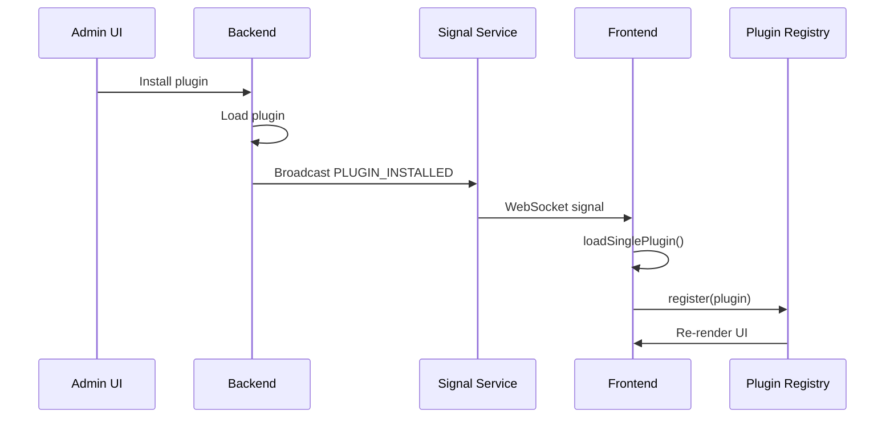

---
---
# Frontend Plugin Development Guide

## Overview

Frontend plugins provide UI components, pages, routing, and client-side services. They are built using **React**, **React Router**, **ShadCN UI**, and **Vite**.

Frontend plugins consume **oRPC contracts** defined in `-common` packages, enabling type-safe RPC communication with the backend.

## Quick Start

### 1. Scaffold Plugin with CLI

The fastest way to create a frontend plugin is using the CLI:

```bash
bun run create
```

**Interactive prompts:**
1. Select `frontend` as the plugin type
2. Enter your plugin name (e.g., `myfeature`)
3. Provide a description (optional)
4. Confirm to generate

This will create a complete plugin structure with:
- ✅ Package configuration with React, router, and UI dependencies
- ✅ TypeScript configuration
- ✅ Contract-based API definition with typed client imports
- ✅ Example list page component with CRUD operations
- ✅ Plugin registration with routes and navigation
- ✅ Initial changeset for version management

**Generated structure:**
```
plugins/myfeature-frontend/
├── .changeset/
│   └── initial.md              # Version changeset
├── package.json                # Dependencies
├── tsconfig.json               # TypeScript config
├── README.md                   # Documentation
└── src/
    ├── index.tsx               # Plugin entry point
    ├── api.ts                  # Contract-derived API types
    └── components/
        └── MyFeatureListPage.tsx  # Example page
```

### 2. Install Dependencies

```bash
cd plugins/myfeature-frontend
bun install
```

### 3. Customize Your Plugin

The generated plugin is a working example. Customize it for your domain:

#### Update API Types

**src/api.ts:**

The API types are imported from your common package (no derivation needed):

```typescript
import { createApiRef } from "@checkmate-monitor/frontend-api";
import { MyFeatureClient } from "@checkmate-monitor/myfeature-common";

// Re-export types for convenience
export type {
  MyItem,
  CreateMyItem,
  UpdateMyItem,
} from "@checkmate-monitor/myfeature-common";

// Use the client type from the common package
export type MyFeatureApi = MyFeatureClient;

export const myFeatureApiRef = createApiRef<MyFeatureApi>("myfeature-api");
```

#### Create Your Components

**src/components/MyFeaturePage.tsx:**

```typescript
import { useEffect, useState } from "react";
import { useApi } from "@checkmate-monitor/frontend-api";
import { myFeatureApiRef, type MyItem } from "../api";
import { Button, Card } from "@checkmate-monitor/ui";

export const MyFeaturePage = () => {
  const api = useApi(myFeatureApiRef);
  const [items, setItems] = useState<MyItem[]>([]);

  useEffect(() => {
    api.getItems().then(setItems);
  }, [api]);

  return (
    <div className="p-6">
      <h1 className="text-2xl font-bold mb-4">My Features</h1>
      <div className="grid gap-4">
        {items.map((item) => (
          <Card key={item.id} className="p-4">
            <h3>{item.name}</h3>
          </Card>
        ))}
      </div>
    </div>
  );
};
```

#### Register Routes

**src/index.tsx:**

```typescript
import { createFrontendPlugin, rpcApiRef, type ApiRef } from "@checkmate-monitor/frontend-api";
import { myFeatureApiRef, type MyFeatureApiClient } from "./api";
import { MyFeaturePage } from "./components/MyFeaturePage";
import { myFeatureRoutes, MyFeatureApi, pluginMetadata } from "@checkmate-monitor/myfeature-common";

export const myFeaturePlugin = createFrontendPlugin({
  metadata: pluginMetadata,

  // Register client API using Api definition
  apis: [
    {
      ref: myFeatureApiRef,
      factory: (deps: { get: <T>(ref: ApiRef<T>) => T }): MyFeatureApiClient => {
        const rpcApi = deps.get(rpcApiRef);
        return rpcApi.forPlugin(MyFeatureApi);
      },
    },
  ],

  // Register routes using typed route definitions
  routes: [
    {
      route: myFeatureRoutes.routes.home,
      element: <MyFeaturePage />,
    },
  ],
});
```

### 4. Verify

```bash
# Type check
bun run typecheck

# Lint
bun run lint
```

That's it! Your frontend plugin is ready to use.

> **Note:** Make sure you have also created the corresponding `-common` and `-backend` packages. See [Common Plugin Guidelines](../common/plugins.md) and [Backend Plugin Development](../backend/plugins.md) for details.

## Plugin Configuration

### `createFrontendPlugin(config)`

Creates a frontend plugin with the specified configuration.

**Parameters:**

#### `metadata` (required)

Plugin metadata from the common package (contains pluginId).

```typescript
import { pluginMetadata } from "@checkmate-monitor/myplugin-common";

metadata: pluginMetadata
```

#### `apis` (optional)

Register client-side APIs that components can use.

```typescript
import { MyPluginApi } from "@checkmate-monitor/myplugin-common";
import type { InferClient } from "@checkmate-monitor/common";

export type MyPluginApiClient = InferClient<typeof MyPluginApi>;

apis: [
  {
    ref: myPluginApiRef,
    factory: (deps): MyPluginApiClient => {
      const rpcApi = deps.get(rpcApiRef);
      return rpcApi.forPlugin(MyPluginApi);
    },
  },
]
```

#### `routes` (optional)

Register pages and their routes using RouteDefinitions from the common package.

```typescript
import { myRoutes } from "@checkmate-monitor/myplugin-common";

routes: [
  {
    route: myRoutes.routes.home,
    element: <ItemListPage />,
    title: "Items", // Optional: page title
    permission: permissions.itemRead.id, // Optional: required permission
  },
]
```

#### `extensions` (optional)

Register components to inject into extension slots.

```typescript
import { UserMenuItemsSlot } from "@checkmate-monitor/frontend-api";

extensions: [
  {
    id: "myplugin.user-menu.items",
    slot: UserMenuItemsSlot,
    component: MyUserMenuItems,
  },
]
```

## Contract-Based Client API Pattern

The frontend consumes Api definitions from `-common` packages to get type-safe RPC clients with automatic type inference.

### Step 1: Import Api and Create Client Type

**src/api.ts:**

```typescript
import { createApiRef } from "@checkmate-monitor/frontend-api";
import { MyPluginApi } from "@checkmate-monitor/myplugin-common";
import type { InferClient } from "@checkmate-monitor/common";

// Re-export types from common for convenience
export type { Item, CreateItem, UpdateItem } from "@checkmate-monitor/myplugin-common";

// Derive client type from Api definition
export type MyPluginApiClient = InferClient<typeof MyPluginApi>;

export const myPluginApiRef = createApiRef<MyPluginApiClient>("myplugin-api");
```

**Why import Api from common?**
- Api definition contains pluginId and contract bundled together
- Provides compile-time type safety for all RPC calls
- No string plugin IDs - automatic type inference
- Usable by both frontend and backend for type-safe calls

### Step 2: Register API Factory

**src/index.tsx:**

```typescript
import { rpcApiRef, type ApiRef } from "@checkmate-monitor/frontend-api";
import { myPluginApiRef, type MyPluginApiClient } from "./api";
import { MyPluginApi, pluginMetadata } from "@checkmate-monitor/myplugin-common";

export const myPlugin = createFrontendPlugin({
  metadata: pluginMetadata,
  
  apis: [
    {
      ref: myPluginApiRef,
      factory: (deps: { get: <T>(ref: ApiRef<T>) => T }): MyPluginApiClient => {
        const rpcApi = deps.get(rpcApiRef);
        // Create a client using the Api definition
        // The pluginId is automatically extracted from MyPluginApi
        return rpcApi.forPlugin(MyPluginApi);
      },
    },
  ],
});
```

**Key changes from legacy pattern:**
- Uses `metadata: pluginMetadata` instead of `name: "..."`
- Uses `forPlugin(MyPluginApi)` instead of `forPlugin<Type>("pluginId")`
- Type inference is automatic - no explicit type parameter needed

### Step 3: Use in Components

```typescript
import { useApi } from "@checkmate-monitor/frontend-api";
import { myPluginApiRef } from "../api";

export const ItemListPage = () => {
  const api = useApi(myPluginApiRef);
  const [items, setItems] = useState<Item[]>([]);

  useEffect(() => {
    // Type-safe RPC call - no manual URL construction!
    api.getItems().then(setItems);
  }, [api]);

  const handleCreate = async (data: CreateItem) => {
    // Input types are automatically inferred from the contract
    const newItem = await api.createItem(data);
    setItems([...items, newItem]);
  };

  return (
    <div>
      {items.map((item) => (
        <div key={item.id}>{item.name}</div>
      ))}
    </div>
  );
};
```

### Benefits of Contract-Based Clients

1. **No Manual URL Construction**: RPC procedures are called like functions
2. **Full Type Safety**: Input and output types inferred from contract
3. **Auto-completion**: IDE suggests available procedures and their parameters
4. **Compile-Time Errors**: Contract changes immediately break incompatible frontend code
5. **No Duplication**: Single source of truth for API definitions

## Core APIs

The core provides these APIs for use in components:

### `rpcApiRef`

The oRPC client factory for creating type-safe plugin clients.

```typescript
import { MyPluginApi } from "@checkmate-monitor/myplugin-common";

const rpcApi = useApi(rpcApiRef);

// Create a client for a specific backend plugin using its Api definition
const client = rpcApi.forPlugin(MyPluginApi);
```

### `permissionApiRef`

Check user permissions.

```typescript
const permissionApi = useApi(permissionApiRef);

const canManage = permissionApi.usePermission(permissions.itemManage.id);

if (canManage.allowed) {
  // Show management UI
}
```

### `authApiRef`

Access authentication state.

```typescript
const authApi = useApi(authApiRef);

const session = authApi.useSession();

if (session.user) {
  // User is logged in
}
```

## Permission Gating

### Route-Level Permissions

```typescript
import { permissions } from "@checkmate-monitor/myplugin-common";

routes: [
  {
    path: "/config",
    element: <ItemConfigPage />,
    permission: permissions.itemManage.id,
  },
]
```

Users without the permission will see an "Access Denied" page.

### Component-Level Permissions

```typescript
import { useApi, permissionApiRef } from "@checkmate-monitor/frontend-api";
import { permissions } from "@checkmate-monitor/myplugin-common";

export const ItemListPage = () => {
  const permissionApi = useApi(permissionApiRef);
  const canCreate = permissionApi.usePermission(permissions.itemCreate.id);

  return (
    <div>
      <h1>Items</h1>
      {canCreate.allowed && (
        <Button onClick={handleCreate}>Create Item</Button>
      )}
    </div>
  );
};
```

### Permission Loading State

```typescript
const permission = permissionApi.usePermission(permissions.itemManage.id);

if (permission.loading) {
  return <LoadingSpinner />;
}

if (!permission.allowed) {
  return <PermissionDenied />;
}

return <ItemConfigPage />;
```

## UI Components

Use components from `@checkmate-monitor/ui` for consistent styling:

```typescript
import {
  Button,
  Card,
  Input,
  Label,
  Table,
  Dialog,
  Select,
  Checkbox,
} from "@checkmate-monitor/ui";

export const ItemForm = () => {
  return (
    <Card>
      <Label htmlFor="name">Name</Label>
      <Input id="name" placeholder="Enter name" />
      
      <Label htmlFor="description">Description</Label>
      <Input id="description" placeholder="Enter description" />
      
      <Button type="submit">Save</Button>
    </Card>
  );
};
```

## Extension Slots

### Available Slots

Core slots are available from `@checkmate-monitor/frontend-api`:

```typescript
import {
  DashboardSlot,
  UserMenuItemsSlot,
  UserMenuItemsBottomSlot,
  NavbarRightSlot,
  NavbarLeftSlot,
} from "@checkmate-monitor/frontend-api";
```

### Injecting into Slots

Use the `slot:` property with a `SlotDefinition` object:

```typescript
import { UserMenuItemsSlot } from "@checkmate-monitor/frontend-api";

extensions: [
  {
    id: "myplugin.user-menu.items",
    slot: UserMenuItemsSlot,
    component: MyUserMenuItems,
  },
]
```

### Example: User Menu Items

```typescript
import { DropdownMenuItem } from "@checkmate-monitor/ui";
import { Link } from "react-router-dom";

export const MyUserMenuItems = () => {
  return (
    <>
      <DropdownMenuItem asChild>
        <Link to="/items/config">Item Settings</Link>
      </DropdownMenuItem>
    </>
  );
};
```

## Routing

### Navigation

```typescript
import { Link, useNavigate } from "react-router-dom";

// Using Link
<Link to="/items/123">View Item</Link>

// Using navigate
const navigate = useNavigate();
navigate("/items/123");
```

### Route Parameters

```typescript
import { useParams } from "react-router-dom";

export const ItemDetailPage = () => {
  const { id } = useParams<{ id: string }>();
  
  // Use id to fetch item
};
```

### Query Parameters

```typescript
import { useSearchParams } from "react-router-dom";

export const ItemListPage = () => {
  const [searchParams, setSearchParams] = useSearchParams();
  
  const page = searchParams.get("page") || "1";
  const filter = searchParams.get("filter") || "";
  
  const handlePageChange = (newPage: number) => {
    setSearchParams({ page: newPage.toString(), filter });
  };
};
```

## State Management

### Local State

```typescript
import { useState } from "react";

export const ItemForm = () => {
  const [name, setName] = useState("");
  const [description, setDescription] = useState("");
  
  return (
    <form>
      <Input value={name} onChange={(e) => setName(e.target.value)} />
      <Input value={description} onChange={(e) => setDescription(e.target.value)} />
    </form>
  );
};
```

### Server State with RPC

```typescript
import { useEffect, useState } from "react";
import { useApi } from "@checkmate-monitor/frontend-api";
import { myPluginApiRef, type Item } from "../api";

export const ItemListPage = () => {
  const api = useApi(myPluginApiRef);
  const [items, setItems] = useState<Item[]>([]);
  const [loading, setLoading] = useState(true);
  const [error, setError] = useState<Error | null>(null);

  useEffect(() => {
    api
      .getItems()
      .then(setItems)
      .catch(setError)
      .finally(() => setLoading(false));
  }, [api]);

  if (loading) return <LoadingSpinner />;
  if (error) return <ErrorMessage error={error} />;

  return <ItemList items={items} />;
};
```

## Forms

### Basic Form

```typescript
import { useState } from "react";
import { Button, Input, Label } from "@checkmate-monitor/ui";

export const ItemForm = ({ onSubmit }: { onSubmit: (data: ItemData) => void }) => {
  const [name, setName] = useState("");
  const [description, setDescription] = useState("");

  const handleSubmit = (e: React.FormEvent) => {
    e.preventDefault();
    onSubmit({ name, description });
  };

  return (
    <form onSubmit={handleSubmit}>
      <div>
        <Label htmlFor="name">Name</Label>
        <Input
          id="name"
          value={name}
          onChange={(e) => setName(e.target.value)}
          required
        />
      </div>
      
      <div>
        <Label htmlFor="description">Description</Label>
        <Input
          id="description"
          value={description}
          onChange={(e) => setDescription(e.target.value)}
        />
      </div>
      
      <Button type="submit">Save</Button>
    </form>
  );
};
```

### Form with Validation

```typescript
import { z } from "zod";

const itemSchema = z.object({
  name: z.string().min(1, "Name is required"),
  description: z.string().optional(),
});

export const ItemForm = () => {
  const [errors, setErrors] = useState<Record<string, string>>({});

  const handleSubmit = (e: React.FormEvent) => {
    e.preventDefault();
    
    const result = itemSchema.safeParse({ name, description });
    
    if (!result.success) {
      const fieldErrors: Record<string, string> = {};
      result.error.errors.forEach((err) => {
        if (err.path[0]) {
          fieldErrors[err.path[0].toString()] = err.message;
        }
      });
      setErrors(fieldErrors);
      return;
    }
    
    onSubmit(result.data);
  };

  return (
    <form onSubmit={handleSubmit}>
      <div>
        <Label htmlFor="name">Name</Label>
        <Input id="name" value={name} onChange={(e) => setName(e.target.value)} />
        {errors.name && <span className="text-red-500">{errors.name}</span>}
      </div>
    </form>
  );
};
```

## Common Patterns

### List Page with RPC

```typescript
import { useApi } from "@checkmate-monitor/frontend-api";
import { myPluginApiRef, type Item } from "../api";

export const ItemListPage = () => {
  const api = useApi(myPluginApiRef);
  const [items, setItems] = useState<Item[]>([]);
  const navigate = useNavigate();

  useEffect(() => {
    api.getItems().then(setItems);
  }, [api]);

  const handleDelete = async (id: string) => {
    await api.deleteItem(id);
    setItems(items.filter(item => item.id !== id));
  };

  return (
    <div className="p-6">
      <div className="flex justify-between items-center mb-4">
        <h1 className="text-2xl font-bold">Items</h1>
        <Button onClick={() => navigate("/items/new")}>Create Item</Button>
      </div>
      
      <Table>
        <TableHeader>
          <TableRow>
            <TableHead>Name</TableHead>
            <TableHead>Description</TableHead>
            <TableHead>Actions</TableHead>
          </TableRow>
        </TableHeader>
        <TableBody>
          {items.map((item) => (
            <TableRow key={item.id}>
              <TableCell>{item.name}</TableCell>
              <TableCell>{item.description}</TableCell>
              <TableCell>
                <Button onClick={() => navigate(`/items/${item.id}`)}>
                  View
                </Button>
                <Button onClick={() => handleDelete(item.id)} variant="destructive">
                  Delete
                </Button>
              </TableCell>
            </TableRow>
          ))}
        </TableBody>
      </Table>
    </div>
  );
};
```

### Detail Page

```typescript
export const ItemDetailPage = () => {
  const { id } = useParams<{ id: string }>();
  const api = useApi(myPluginApiRef);
  const [item, setItem] = useState<Item | null>(null);

  useEffect(() => {
    if (id) {
      api.getItem(id).then(setItem);
    }
  }, [id, api]);

  if (!item) return <LoadingSpinner />;

  return (
    <div className="p-6">
      <h1 className="text-2xl font-bold">{item.name}</h1>
      <p>{item.description}</p>
    </div>
  );
};
```

### Create/Edit Page

```typescript
export const ItemEditPage = () => {
  const { id } = useParams<{ id: string }>();
  const api = useApi(myPluginApiRef);
  const navigate = useNavigate();
  const [item, setItem] = useState<Item | null>(null);

  useEffect(() => {
    if (id) {
      api.getItem(id).then(setItem);
    }
  }, [id, api]);

  const handleSubmit = async (data: CreateItem) => {
    if (id) {
      await api.updateItem({ id, data });
    } else {
      await api.createItem(data);
    }
    navigate("/items");
  };

  return (
    <div className="p-6">
      <h1 className="text-2xl font-bold">
        {id ? "Edit Item" : "Create Item"}
      </h1>
      <ItemForm initialData={item} onSubmit={handleSubmit} />
    </div>
  );
};
```

## Best Practices

### 1. Use TypeScript

Always type your components and APIs:

```typescript
interface ItemListProps {
  items: Item[];
  onItemClick: (id: string) => void;
}

export const ItemList: React.FC<ItemListProps> = ({ items, onItemClick }) => {
  // ...
};
```

### 2. Extract Reusable Components

```typescript
// components/ItemCard.tsx
export const ItemCard = ({ item }: { item: Item }) => {
  return (
    <Card>
      <h3>{item.name}</h3>
      <p>{item.description}</p>
    </Card>
  );
};
```

### 3. Handle Loading and Error States

```typescript
if (loading) return <LoadingSpinner />;
if (error) return <ErrorMessage error={error} />;
if (!data) return <EmptyState />;
```

### 4. Use Semantic HTML

```typescript
<main>
  <header>
    <h1>Items</h1>
  </header>
  <section>
    <ItemList items={items} />
  </section>
</main>
```

### 5. Accessibility

```typescript
<Button aria-label="Delete item">
  <TrashIcon />
</Button>

<Input
  id="name"
  aria-describedby="name-error"
  aria-invalid={!!errors.name}
/>
```

### 6. Leverage Contract Types

Import types from the common package instead of redefining them:

```typescript
// ✅ Good - Use contract types
import type { Item, CreateItem } from "@checkmate-monitor/myplugin-common";

// ❌ Bad - Duplicate type definitions
interface Item {
  id: string;
  name: string;
  // ...
}
```

## Testing

### Component Tests

```typescript
import { describe, expect, test } from "bun:test";
import { render, screen } from "@testing-library/react";
import { ItemCard } from "./ItemCard";

describe("ItemCard", () => {
  test("renders item name", () => {
    const item = { id: "1", name: "Test Item" };
    render(<ItemCard item={item} />);
    expect(screen.getByText("Test Item")).toBeInTheDocument();
  });
});
```

### E2E Tests with Playwright

```typescript
import { test, expect } from "@playwright/test";

test("create item", async ({ page }) => {
  await page.goto("/items");
  await page.click("text=Create Item");
  await page.fill("#name", "New Item");
  await page.click("text=Save");
  await expect(page.locator("text=New Item")).toBeVisible();
});
```

## Troubleshooting

### API Not Found

Check that:
1. API is registered in plugin `apis` array
2. API ref is created with `createApiRef`
3. Factory function uses `rpcApi.forPlugin(*Api)` with the Api definition from common
4. Api definition's `pluginId` matches backend router registration name

### Type Errors with Contract

If TypeScript complains about contract types:
1. Ensure you're importing from the `-common` package
2. Verify the `*Api` definition and contract are exported from `src/index.ts`
3. Clear TypeScript cache: `rm -rf tsconfig.tsbuildinfo`
4. Restart the TypeScript language server

### Routes Not Working

Check that:
1. Routes are registered in plugin `routes` array
2. Route definitions use `route:` with RouteDefinition from common
3. Element is a valid React component

### Permission Errors

Check that:
1. Permission ID matches backend permission
2. User has required role/permission
3. Permission check is not in loading state

### 404 Errors from Backend

If RPC calls return 404:
1. Verify backend router is registered with correct plugin ID
2. Ensure frontend uses the correct Api definition that matches backend pluginId
3. Check backend plugin is loaded (check backend logs)

## Migrating from Legacy REST Clients

If you have legacy clients using manual `fetch()` calls:

### Before (Legacy Pattern)

```typescript
export class MyPluginClient implements MyPluginApi {
  constructor(private fetchApi: FetchApi) {}

  async getItems(): Promise<Item[]> {
    return this.fetchApi.fetch("/api/myplugin/items");
  }

  async createItem(data: CreateItem): Promise<Item> {
    return this.fetchApi.fetch("/api/myplugin/items", {
      method: "POST",
      body: JSON.stringify(data),
    });
  }
}
```

### After (oRPC Pattern)

```typescript
// src/api.ts
import { createApiRef } from "@checkmate-monitor/frontend-api";
import { MyPluginApi } from "@checkmate-monitor/myplugin-common";
import type { InferClient } from "@checkmate-monitor/common";

export type MyPluginApiClient = InferClient<typeof MyPluginApi>;
export const myPluginApiRef = createApiRef<MyPluginApiClient>("myplugin-api");

// src/index.tsx
apis: [
  {
    ref: myPluginApiRef,
    factory: (deps): MyPluginApiClient => {
      const rpcApi = deps.get(rpcApiRef);
      return rpcApi.forPlugin(MyPluginApi);
    },
  },
]
```

**Benefits:**
- No manual client class needed
- No hardcoded URLs or plugin IDs
- Automatic type inference from Api definition
- Compile-time contract validation

## Dynamic Plugin Loading

Frontend plugins can be loaded and unloaded at runtime without a page refresh. When a frontend plugin is installed or uninstalled on the backend, the platform broadcasts a signal to all connected frontends, triggering automatic UI updates.

### Architecture



### How It Works

1. **Signal Emission**: The backend emits `PLUGIN_INSTALLED` or `PLUGIN_DEREGISTERED` signals only for frontend plugins (those ending with `-frontend`)

2. **Frontend Signal Subscription**: The `usePluginLifecycle` hook listens for these signals:
   ```typescript
   // Automatically handled in App.tsx via usePluginLifecycle()
   useSignal(PLUGIN_INSTALLED, ({ pluginId }) => {
     loadSinglePlugin(pluginId);  // Dynamically loads JS/CSS
   });

   useSignal(PLUGIN_DEREGISTERED, ({ pluginId }) => {
     unloadPlugin(pluginId);  // Removes from registry
   });
   ```

3. **Registry Updates**: When a plugin is loaded/unloaded, the `pluginRegistry` increments its version, triggering React re-renders to pick up new routes and extensions.

### Plugin Registry Reactivity

The `pluginRegistry` supports dynamic updates:

```typescript
// Subscribe to registry changes
pluginRegistry.subscribe(() => {
  console.log("Registry changed, re-render!");
});

// Check if a plugin is registered
if (pluginRegistry.hasPlugin("my-plugin-frontend")) {
  // Plugin is available
}

// Get current version (increments on every change)
const version = pluginRegistry.getVersion();
```

### Signals Used

| Signal | Payload | Description |
|--------|---------|-------------|
| `PLUGIN_INSTALLED` | `{ pluginId: string }` | Frontend plugin was installed |
| `PLUGIN_DEREGISTERED` | `{ pluginId: string }` | Frontend plugin was removed |

> **Note**: Only plugins ending with `-frontend` trigger signals. Backend-only plugins are not signaled to the frontend.

## Next Steps

- [Backend Plugin Development](../backend/plugins.md)
- [Common Plugin Guidelines](../common/plugins.md)
- [Extension Points](./extension-points.md)
- [UI Component Library](../core/ui/README.md)

