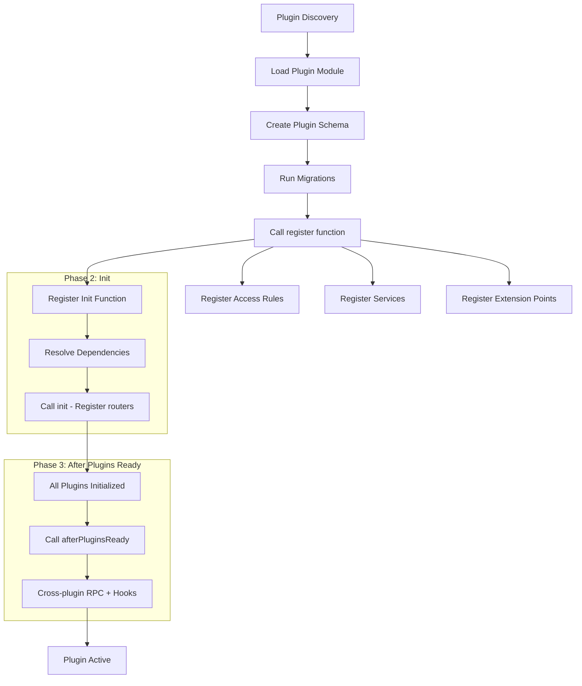
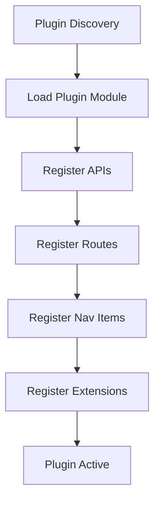
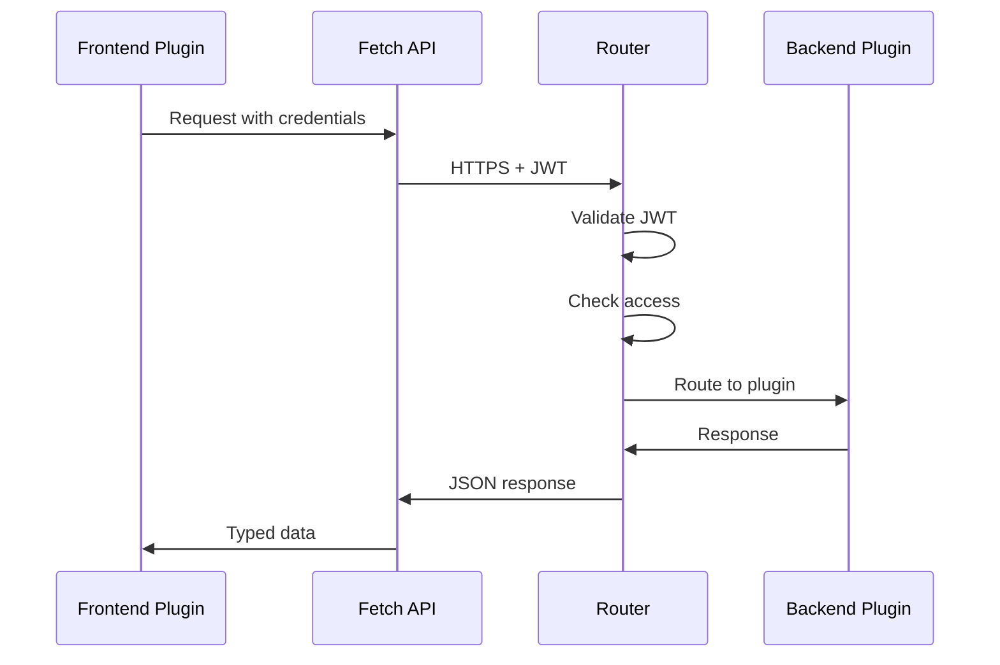
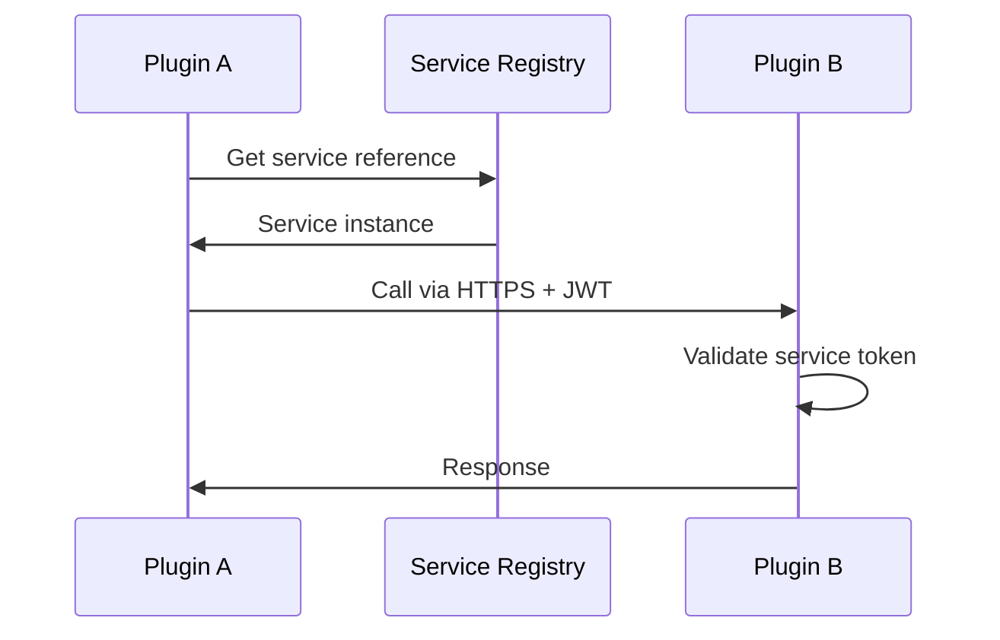

## Introduction

Checkstack is built on a **pluggable architecture** that enables extensibility, modularity, and flexible deployment options. Everything beyond the core framework is implemented as a plugin, allowing the system to scale from monolithic deployments to distributed microservices.

## Core Principles

### 1. Runtime Registration

Plugins **MUST** be registerable at runtime. This design enables:
- Loading plugins from remote sources without code changes
- Hot-swapping plugins during development
- Dynamic feature enablement based on deployment needs

The platform supports four install sources, all going through a discriminated
`PluginSource` union and a per-source `PluginInstaller`:

| Source     | Use case                                        |
|------------|-------------------------------------------------|
| `npm`      | Public or private npm registry (configurable)   |
| `tarball`  | Uploaded `.tgz` (filesystem analogue)           |
| `github`   | GitHub release asset (`.tgz` packed by our CLI) |
| `catalog`  | Curated marketplace (stub — coming soon)        |

Plugin tarballs (single package or `--bundle`-mode multi-package) are
persisted in `plugin_artifacts` (Postgres `bytea`). A freshly spun replica
recovers every runtime-installed plugin from this table at boot — no
re-fetch from the original source is needed for replicas to come up.

For plugin authors: see [Plugin Distribution & Packing](/checkstack/developer-guide/architecture/plugin-distribution/)
for the developer-facing guide on packing, bundles, npm/GitHub/tarball
distribution, and the `bunx @checkstack/scripts plugin-pack` CLI.

### 2. Inversion of Control (IoC)

Plugins register themselves with the core application through well-defined interfaces:
- **Backend plugins** register via `BackendPluginRegistry`
- **Frontend plugins** register via `FrontendPlugin` interface

The core calls plugin registration functions, not the other way around.

### 3. Secure Service-to-Service Communication

All plugin-to-plugin communication happens via:
- **HTTPS** for transport security
- **Signed JWTs** for authentication
- **Configured secrets** for token signing

This ensures security even in distributed deployments.

### 4. Modular Project Structure

Each plugin is a standalone npm package that can:
- Run independently
- Be deployed as part of a monolith
- Be deployed as a separate microservice
- Share code through common packages

## Project Structure

```
checkstack/
├── core/
│   ├── backend/           # Core backend framework
│   ├── frontend/          # Core frontend framework
│   ├── backend-api/       # Backend plugin API
│   ├── frontend-api/      # Frontend plugin API
│   ├── common/            # Shared core types
│   ├── ui/                # Shared UI components
│   │
│   ├── auth-*/            # Authentication (essential)
│   ├── catalog-*/         # Entity management (essential)
│   ├── notification-*/    # Notifications (essential)
│   ├── healthcheck-*/     # Health monitoring (essential)
│   ├── satellite-*/       # Remote satellite agents (essential)
│   ├── queue-*/           # Queue abstraction (essential)
│   └── theme-*/           # UI theming (essential)
│
└── plugins/               # Replaceable providers only
    ├── auth-github-backend/       # GitHub OAuth provider
    ├── auth-credential-backend/   # Username/password auth
    ├── auth-ldap-backend/         # LDAP auth provider
    ├── queue-bullmq-*/            # BullMQ implementation
    ├── queue-memory-*/            # In-memory implementation
    └── healthcheck-http-backend/  # HTTP health strategy
```

> **Note:** See [Packages vs Plugins Architecture](/checkstack/developer-guide/architecture/packages-vs-plugins/) for decision criteria on when to create a package vs a plugin.

## Package Types

Checkstack uses a strict package type system to maintain clean architecture:

| Package Type | Suffix/Pattern | Purpose | Can Depend On |
|--------------|---------------|---------|---------------|
| **Backend** | `-backend` | REST APIs, business logic, database | Backend packages, common packages |
| **Frontend** | `-frontend` | UI components, pages, routing | Frontend packages, common packages |
| **Common** | `-common` | Shared types, access rules, constants | Common packages only |
| **Node** | `-node` | Backend-only shared code | Backend packages, common packages |
| **React** | `-react` | Frontend-only shared components | Frontend packages, common packages |

### Dependency Rules

These rules are **automatically enforced** by the dependency linter:

- ✅ **Common** → Common only
- ✅ **Frontend** → Frontend or Common
- ✅ **Backend** → Backend or Common
- ❌ **Common** → Backend or Frontend (FORBIDDEN)
- ❌ **Frontend** → Backend (FORBIDDEN)

See [dependency-linter.md](/checkstack/developer-guide/tooling/dependency-linter/) for details.

## Plugin Lifecycle

### Backend Plugin Lifecycle

Backend plugins use a **two-phase initialization** to ensure cross-plugin communication works correctly:



> **Key Point:** The `init` function registers routers and services. The `afterPluginsReady` callback runs after ALL plugins have initialized, making it safe to:
> - Call other plugins via RPC
> - Subscribe to hooks (`onHook`)
> - Emit hooks (`emitHook`)

### Frontend Plugin Lifecycle



## Database Isolation

Each backend plugin gets its own **isolated PostgreSQL schema**:

```
Database: checkstack
├── Schema: public (core only)
├── Schema: plugin_catalog-backend
├── Schema: plugin_auth-backend
└── Schema: plugin_healthcheck-backend
```

### Benefits

- **Namespace isolation**: No table name conflicts
- **Independent migrations**: Each plugin manages its own schema
- **Security**: Plugins can't access each other's data directly
- **Scalability**: Easy to split into separate databases later

See [Drizzle Schema Isolation](/checkstack/developer-guide/backend/drizzle-schema/) for implementation details.

## Extension Points

Extension points enable plugins to provide implementations for core functionality:

### Backend Extension Points

- **HealthCheckStrategy**: Implement custom health check methods
- **ExporterStrategy**: Export metrics and data in various formats
- **NotificationStrategy**: Send notifications via different channels
- **AuthenticationStrategy**: Integrate authentication providers

### Frontend Extension Points

- **Slots**: Inject UI components into predefined locations
- **Routes**: Add new pages to the application
- **APIs**: Provide client-side services

See [Extension Points](/checkstack/developer-guide/frontend/extension-points/) for detailed documentation.

## Configuration Management

Plugins use **versioned configurations** to support backward compatibility:

```typescript
interface VersionedConfig<T> {
  version: number;
  pluginId: string;
  data: T;
  migratedAt?: Date;
  originalVersion?: number;
}
```

This enables:
- Schema evolution without breaking existing configs
- Automatic migration of old configurations
- Rollback support

See [versioned-configs.md](/checkstack/developer-guide/backend/versioned-configs/) for details.

## Communication Patterns

### Frontend ↔ Backend



### Backend ↔ Backend



### WebSocket (Plugin-Registered)

Plugins can register custom WebSocket endpoints via the **WebSocket Route Registry**. All routes are automatically namespaced by plugin ID to prevent collisions:

```typescript
// In satellite-backend's afterPluginsReady:
wsRegistry.register("/", wsHandler);
// → Available at /api/ws/satellite

// Plugins can register sub-paths too:
wsRegistry.register("/events", eventsHandler);
// → Available at /api/ws/{pluginId}/events
```

The registry uses the same **scoped factory pattern** as RPC and health check registries — plugins never provide their ID manually.

> **Note:** The signal/realtime WebSocket (`/api/signals/ws`) uses Bun's native pub/sub and is handled separately from the registry.

## Access System

Access rules are defined in common packages and registered by backend plugins:

```typescript
// In catalog-common
export const access = {
  entityRead: {
    id: "entity.read",
    description: "Read Systems and Groups",
  },
} satisfies Record<string, AccessRule>;

// In catalog-backend
env.registerAccessRules(accessRuleList);

// In catalog-frontend
const canRead = accessApi.useAccess(access.entityRead.id);
```

The core automatically prefixes access rules with the plugin ID: `catalog.entity.read`

## Technology Stack

### Backend
- **Runtime**: Bun
- **Framework**: Hono (HTTP routing)
- **Database**: PostgreSQL + Drizzle ORM
- **Validation**: Zod
- **Testing**: Bun test runner

### Frontend
- **Framework**: React
- **Routing**: React Router DOM
- **UI**: ShadCN + Tailwind CSS
- **Build**: Vite
- **Testing**: Playwright (E2E)

## Deployment Options

### Monolith (Default)

All plugins run in a single process:
```bash
bun run dev
```

### Microservices

Each plugin can run independently:
```bash
# Terminal 1
bun run dev:backend --plugins=catalog-backend

# Terminal 2
bun run dev:backend --plugins=auth-backend

# Terminal 3
bun run dev:frontend
```

### Hybrid

Mix and match based on scaling needs:
- Core + frequently-used plugins in monolith
- Resource-intensive plugins as separate services
- Geographic distribution for compliance

## Next Steps

- [Packages vs Plugins Architecture](/checkstack/developer-guide/architecture/packages-vs-plugins/)
- [Plugin Distribution & Packing](/checkstack/developer-guide/architecture/plugin-distribution/)
- [Backend Plugin Development](/checkstack/developer-guide/backend/plugins/)
- [Frontend Plugin Development](/checkstack/developer-guide/frontend/plugins/)
- [Common Plugin Guidelines](/checkstack/developer-guide/common/plugins/)
- [Extension Points](/checkstack/developer-guide/frontend/extension-points/)
- [Versioned Configurations](/checkstack/developer-guide/backend/versioned-configs/)
- [Health and Readiness Probes](/checkstack/user-guide/reference/health-probes/)
- [Contributing Guide](/checkstack/developer-guide/getting-started/contributing/)
