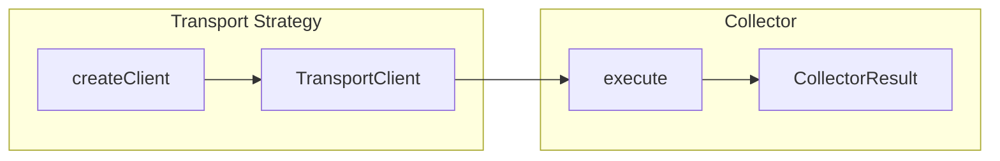

## Overview

Collectors extend health check strategies by providing additional diagnostic metrics collection. While strategies handle **transport connectivity** (SSH, HTTP, SQL, etc.), collectors handle **domain-specific data extraction** through those transports.

**Key Separation:**
| Component | Responsibility | Example |
|-----------|----------------|---------|
| **Strategy** | Establish connection, provide transport client | SSH strategy connects to server |
| **Collector** | Use transport client to gather metrics | CPU collector runs commands via SSH |

This separation allows any collector to work with any compatible transport - CPU metrics can be collected over SSH, HTTP services can be checked via the HTTP transport, etc.

## Architecture



1. **Platform Executor** calls the strategy's `createClient()` to establish a connection
2. **Collectors** receive the connected `TransportClient` via their `execute()` method
3. **Results** are stored in `metadata.collectors.[instanceUUID]` with `_collectorId` metadata

### Collector Instance Identification

Each collector instance in a health check configuration has a unique UUID. When results are stored:

```typescript
// In metadata.collectors:
{
  "550e8400-e29b-41d4-a716-446655440000": {
    "_collectorId": "healthcheck-ssh.cpu",  // Type identifier for schema linking
    "usagePercent": 45.2,
    "loadAvg1m": 0.15
  },
  "6ba7b810-9dad-11d1-80b4-00c04fd430c8": {
    "_collectorId": "healthcheck-ssh.cpu",  // Same type, different instance
    "usagePercent": 32.8,
    "loadAvg1m": 0.08
  }
}
```

This allows multiple collectors of the same type to coexist without data collision.

## CollectorStrategy Interface

```typescript
import type { TransportClient } from "@checkstack/backend-api";

interface CollectorStrategy<
  TClient extends TransportClient<unknown, unknown>,
  TConfig = unknown,
  TResult = Record<string, unknown>,
  TAggregated = Record<string, unknown>
> {
  /** Unique identifier for this collector */
  id: string;

  /** Human-readable name */
  displayName: string;

  /** Optional description */
  description?: string;

  /** PluginMetadata of transport strategies this collector supports */
  supportedPlugins: PluginMetadata[];

  /** Allow multiple instances per health check config (default: false) */
  allowMultiple?: boolean;

  /** Collector configuration schema with versioning */
  config: Versioned<TConfig>;

  /** Per-execution result schema (with x-chart-* metadata) */
  result: Versioned<TResult>;

  /** Aggregated result schema for bucket storage */
  aggregatedResult: Versioned<TAggregated>;

  /** Execute the collector using the provided transport client */
  execute(params: {
    config: TConfig;
    client: TClient;
    pluginId: string;
  }): Promise<CollectorResult<TResult>>;

  /** Incrementally merge a new run into the aggregated result */
  mergeResult(
    existing: TAggregated | undefined,
    run: HealthCheckRunForAggregation<TResult>
  ): TAggregated;
}
```

### Generic Parameters

| Parameter | Description |
|-----------|-------------|
| `TClient` | Transport client type (e.g., `SshTransportClient`, `HttpTransportClient`) |
| `TConfig` | Collector configuration schema type |
| `TResult` | Per-execution result type |
| `TAggregated` | Aggregated result type for bucket storage |

## Transport failure vs assertable metric (MUST follow)

> [!IMPORTANT]
> A collector MUST fail (set `CollectorResult.error`, or throw) **only when the
> transport itself failed** - i.e. the probe could not complete. It MUST NOT
> fail because a successfully-received application result was "not what you
> hoped". This is a hard rule for every collector.

The run executor turns a collector's outcome into a health status like this:

- The collector **threw**, or returned a non-empty `error` field => the run is
  treated as a **transport failure** and short-circuits to `unhealthy` before
  assertions run.
- The collector returned a `result` with no `error` => **transport success**.
  The run's health is then decided by the user's **assertions** against the
  result fields (or, with no assertions, defaults to `healthy`).

So `error` is reserved for "the probe could not complete". Everything the
server actually told you is a **metric the user asserts on**.

### What counts as a transport failure

Set `error` / throw ONLY for these:

- Connection refused, host unreachable, DNS resolution failure.
- TCP / TLS connect failure, or a TLS **handshake that cannot complete**.
- Timeout / aborted request; the probe could not finish.
- A protocol-level error that prevented getting a result at all.
- A process / script that could not be spawned.
- A configuration error that prevents the probe from running (e.g. an invalid,
  un-renderable URL, or an input that fails a security guard).

### What is an assertable metric (NEVER fail the collector)

Record these in `result` and let assertions decide health:

| Strategy | Assertable metric (NOT a failure) |
|----------|-----------------------------------|
| HTTP | `statusCode` / `statusText` - a 404 or 500 is a **completed** request |
| gRPC | the health `status` enum / `serving` - `NOT_SERVING` is a completed RPC |
| SQL (MySQL/Postgres) | `rowCount` - 0 rows is a successful query |
| SSH / Script | `exitCode` / `success` - a non-zero exit is a completed command |
| TLS | `daysRemaining`, `valid`, `isSelfSigned` - the handshake still completed |
| Redis / RCON | the returned value - an unexpected value is a completed command |
| Jenkins | `offlineNodes`, build results, queue depth - the API call succeeded |

A metric merely looking "abnormal" must NEVER fail a collector either -
abnormality is handled by assertions and, separately, by the anomaly engine.

### Example: the HTTP request collector

```typescript
async execute({ config, client }): Promise<CollectorResult<RequestResult>> {
  // A real transport failure (DNS, connect, TLS, timeout, aborted) throws out
  // of client.exec and the executor records it as a collector failure.
  const response = await client.exec({ url: config.url, method: config.method });

  // ANY received response - including 4xx/5xx - is a successful collection.
  // `success` is just a metric (2xx/3xx); do NOT set `error` on a non-2xx.
  const success = response.statusCode >= 200 && response.statusCode < 400;

  return {
    result: {
      statusCode: response.statusCode,
      statusText: response.statusText,
      success,
      // ...
    },
    // No `error` here: let "statusCode equals 200" (or "equals 404") decide.
  };
}
```

To make a check unhealthy on a 404, the user adds an assertion like
`statusCode equals 200`; to make a check that WANTS a 404 green, they add
`statusCode equals 404`. The collector stays out of that decision.

## Environment templating in connection and target fields

Free-text connection and target fields support `{{ … }}` templating, so one
config covers many environments. A field opts in by declaring
`configString({ "x-templatable": true })`; the executor renders it PER
environment (after the secret pass, before the strategy client build and the
collector `execute`) against a fixed context:

- `{{ environment.<key> }}` - the resolved environment's custom fields.
- `{{ check.id }}` / `{{ check.name }}` / `{{ check.intervalSeconds }}`.
- `{{ system.id }}` / `{{ system.name }}`.
- `{{ system.metadata.<key> }}` - the system's own custom fields, namespaced
  under `.metadata` so a field cannot shadow `system.id` / `system.name`.

An undefined reference renders to an empty string (the engine runs with
`strict: false`), so a required target field can render EMPTY - for example an
env-less run that references `{{ environment.host }}`.

### Fields that support templating

| Strategy | Templatable fields |
|----------|--------------------|
| HTTP | `url`, header values, `body` |
| TLS | `host`, `servername` |
| TCP | `host` |
| Ping | `host` |
| gRPC | `host`, `service` |
| MySQL | `host`, `database`, `user`, `query` |
| Postgres | `host`, `database`, `user`, `query` |
| SSH | `host`, `username`, `command` |
| Redis | `host`, `args` |
| RCON | `host`, `command` |
| DNS | `hostname`, `nameserver` |
| Jenkins | `url` (`baseUrl`), `jobName` |
| Container | `endpoint`, `container` |

Secret fields (passwords, tokens, keys) are NEVER templatable - the load guard
`assertNoSecretTemplatableConflict` rejects a field marked both secret and
templatable, because secrets and templates are resolved in separate passes.
Script collectors (shell / inline-TS) use `$ENV` / typed context, not `{{ }}`.

### MUST: validate the rendered value (post-render config-error guard)

> [!CAUTION]
> A required target field that renders EMPTY must be treated as a **transport
> failure** (a configuration error that prevents the probe), NEVER a silent
> healthy result. Because a `{{ }}` template is not a valid concrete value, any
> store-time validation (a `.url()`, a `.min(1)` that would reject the template)
> moves to a POST-RENDER check.

Re-validate the concrete rendered value where it is consumed, mirroring the HTTP
`renderedUrlSchema` precedent:

- **Strategy connection fields** (host, database, user, endpoint, base URL):
  validate in `createClient` and **throw** on an empty / invalid render.
  Throwing there is the strategy's transport-failure mechanism, and any
  SSRF / egress guard already runs on the RENDERED host because rendering
  happens before `createClient`.
- **Collector target fields** (query, command, hostname, jobName, container):
  validate in `execute` and **return** a `CollectorResult` with a populated
  `error` on an empty render.

```ts
// Strategy: reject an empty rendered host (transport failure).
const renderedHostSchema = z.string().trim().min(1);
const host = renderedHostSchema.safeParse(validatedConfig.host);
if (!host.success) {
  throw new Error(
    `Rendered host is empty: ${JSON.stringify(validatedConfig.host)}. ` +
      `Check the {{ environment.* }} templating for this environment.`,
  );
}
```

Optional fields (SNI `servername`, gRPC `service`, DNS `nameserver`, Redis
`args`) are marked templatable but are NOT non-empty-guarded: an empty render is
a legitimate "unset".

## Assertion outcomes and analytics

Assertions are the user's grading of a completed collection (see the
transport-vs-metric rule above). The platform records every assertion's outcome
on each run and folds pass/fail tallies into the aggregates, so a check's
assertion history charts the same way its metrics do. The contract lives in
[`healthcheck-common/src/assertion-analytics.ts`](https://github.com/enyineer/checkstack/blob/main/core/healthcheck-common/src/assertion-analytics.ts);
a collector author does not implement any of this, but understanding the shapes
helps when reading stored results.

### Per-run outcomes

Each run stores structured outcomes on the collector entry inside
`result.metadata.collectors`, under the reserved `_assertions` key:

```ts
interface AssertionOutcome {
  key: string;        // canonical identity (see below)
  field: string;
  jsonPath?: string;
  operator: string;
  value?: string;     // expected, stringified (absent for value-less operators)
  passed: boolean;
  actual?: string;    // observed value, stringified and truncated to 200 chars
  message?: string;   // failure detail (absent when passed)
}
```

The legacy `_assertionFailed` (the first failure string) is still written for
backward compatibility with pre-feature readers.

### The assertion key

An assertion's identity is a canonical JSON tuple of
`[field, jsonPath, operator, value]`, produced by `computeAssertionKey` and
reversible with `parseAssertionKey`. This key is how a series is tracked over
time: editing any of those four parts starts a **new** series (the old one stops
accruing), while two identical assertions collapse into one. Because the key is
parseable, a historical series stays displayable even after the assertion that
configured it was edited away.

### Per-bucket counts

Aggregates carry per-assertion pass/fail counts under the platform-owned,
**top-level** `assertions` key of `aggregatedResult` - a sibling of
`collectors`, never nested inside it, so a strategy's or collector's aggregated
merger can never see or mangle it:

```ts
// aggregatedResult.assertions
type BucketAssertionStats = {
  [collectorEntryUuid: string]: {
    [assertionKey: string]: { passCount: number; failCount: number };
  };
};
```

These counts are maintained across **every** aggregation path: the realtime
hourly fold, on-read raw-tier normalization, bucket re-merge, and the daily
retention rollup. They are additive, and are the only `aggregatedResult` content
that survives the daily rollup (see
[Data management](/checkstack/developer-guide/backend/healthchecks/data-management/)).

### Where assertions are evaluated

Locally-executed runs evaluate assertions in the run executor on the core.
Satellite-executed runs are evaluated **at ingest on the core**, inside
`ingestSatelliteResult` - the satellite never evaluates assertions, so this
works for every satellite version with no wire change. A satellite-reported
`healthy` run is downgraded to `unhealthy` when an assertion fails, and ephemeral
result fields (for example raw HTTP bodies) are stripped after evaluation.

> [!NOTE]
> Buffered satellite results are evaluated against the check configuration that
> is current at ingest time, not at execution time - a config change during a
> satellite's offline window applies to the buffered runs it later flushes.

## Transport Clients

Each transport strategy provides a specific client interface:

| Protocol | Client Type | Command/Request | Result |
|----------|-------------|-----------------|--------|
| **SSH** | `SshTransportClient` | `string` (shell command) | `SshCommandResult` |
| **HTTP** | `HttpTransportClient` | `HttpRequest` | `HttpResponse` |
| **PostgreSQL** | `SqlTransportClient` | `SqlQueryRequest` | `SqlQueryResult` |
| **Redis** | `RedisTransportClient` | `RedisCommand` | `RedisCommandResult` |

Collectors declare compatibility via `supportedPlugins`:

```typescript
import { pluginMetadata as sshPluginMetadata } from "@checkstack/healthcheck-ssh-common";

export class CpuCollector implements CollectorStrategy<SshTransportClient, ...> {
  supportedPlugins = [sshPluginMetadata];
  // ...
}
```

## Schema Definitions

### Configuration Schema

Define what the collector needs to run:

```typescript
const cpuConfigSchema = z.object({
  includeLoadAverage: z
    .boolean()
    .default(true)
    .describe("Include 1m, 5m, 15m load averages"),
  includeCoreCount: z
    .boolean()
    .default(true)
    .describe("Include number of CPU cores"),
});
```

### Result Schema with Chart Metadata

Use `healthResultNumber`, `healthResultString`, etc. from `@checkstack/healthcheck-common` to annotate fields for auto-chart generation:

```typescript
import {
  healthResultNumber,
  healthResultString,
  healthResultBoolean,
} from "@checkstack/healthcheck-common";

const cpuResultSchema = z.object({
  usagePercent: healthResultNumber({
    "x-chart-type": "line",
    "x-chart-label": "CPU Usage",
    "x-chart-unit": "%",
  }),
  loadAvg1m: healthResultNumber({
    "x-chart-type": "line",
    "x-chart-label": "Load (1m)",
  }).optional(),
  coreCount: healthResultNumber({
    "x-chart-type": "counter",
    "x-chart-label": "CPU Cores",
  }).optional(),
});
```

### Chart Metadata Keys

These keys are valid on both per-run (`healthResult*`) and aggregated
(`aggregated*`) result fields.

| Key | Required | Description |
|-----|----------|-------------|
| `x-chart-type` | ✅ | Chart type: `line`, `bar`, `counter`, `gauge`, `boolean`, `text`, `status` |
| `x-chart-label` | Optional | Human-readable label (defaults to field name) |
| `x-chart-unit` | Optional | Unit suffix (e.g., `ms`, `%`, `bytes`) |
| `x-chart-priority` | Optional | Tile sort weight in the auto-generated chart grid; lower renders earlier. Fields without one default to `100`, so a headline metric (e.g. `responseTime: 10`) leads without every field needing a weight. |
| `x-chart-good-direction` | Optional | Which direction of change is an improvement, `"up"` or `"down"` - used to color trend indicators (`"down"` for latency, `"up"` for a success rate). |
| `x-chart-true-label` | Optional | Prose for a boolean field's `true` value wherever it surfaces in text, e.g. `"successful"` so a dominance chip reads "Usually successful (98%)" instead of "Usually true". Falls back to a humanized form of the field name. |
| `x-chart-false-label` | Optional | Counterpart for `false`, e.g. `"failing"`. |

> [!IMPORTANT]
> These annotations also drive the **assertion builder**: `x-chart-label` is
> the field name operators pick from, `x-chart-unit` renders as the value
> suffix ("must be less than `500` ms"), the boolean labels phrase the
> conditions ("must be successful"), and `x-chart-priority` orders the field
> picker and seeds new conditions. A well-annotated result schema is what
> makes your collector's assertions readable to non-technical operators - a
> field without `x-chart-label` falls back to a humanized field name.

> [!TIP]
> When `x-chart-good-direction` is unset, the frontend falls back to
> `x-anomaly-direction`: `higher-is-better` reads as `"up"` and
> `lower-is-better` reads as `"down"`. A field with neither renders neutral
> trends. Set `x-chart-good-direction` explicitly for a chartable metric that
> has no anomaly detection, or to override the anomaly-derived default.

```typescript
const cpuAggregatedSchema = z.object({
  avgUsagePercent: healthResultNumber({
    "x-chart-type": "line",
    "x-chart-label": "Avg CPU Usage",
    "x-chart-unit": "%",
    "x-chart-priority": 10, // leads the collector's tile group
    "x-chart-good-direction": "down", // lower CPU is the improvement
  }),
});
```

### Aggregated Result Schema

For bucket-level summaries:

```typescript
const cpuAggregatedSchema = z.object({
  avgUsagePercent: healthResultNumber({
    "x-chart-type": "line",
    "x-chart-label": "Avg CPU Usage",
    "x-chart-unit": "%",
  }),
  maxUsagePercent: healthResultNumber({
    "x-chart-type": "line",
    "x-chart-label": "Max CPU Usage",
    "x-chart-unit": "%",
  }),
});
```

## Complete Example

```typescript
import {
  Versioned,
  z,
  mergeAverage,
  averageStateSchema,
  type AverageState,
  type HealthCheckRunForAggregation,
  type CollectorResult,
  type CollectorStrategy,
} from "@checkstack/backend-api";
import { healthResultNumber } from "@checkstack/healthcheck-common";
import {
  pluginMetadata as sshPluginMetadata,
  type SshTransportClient,
} from "@checkstack/healthcheck-ssh-common";

// Configuration
const cpuConfigSchema = z.object({
  includeLoadAverage: z.boolean().default(true),
});

type CpuConfig = z.infer<typeof cpuConfigSchema>;

// Result with chart annotations
const cpuResultSchema = z.object({
  usagePercent: healthResultNumber({
    "x-chart-type": "line",
    "x-chart-label": "CPU Usage",
    "x-chart-unit": "%",
  }),
  loadAvg1m: healthResultNumber({
    "x-chart-type": "line",
    "x-chart-label": "Load (1m)",
  }).optional(),
});

type CpuResult = z.infer<typeof cpuResultSchema>;

// Aggregated display schema (what's shown in charts)
const cpuAggregatedDisplaySchema = z.object({
  avgUsagePercent: healthResultNumber({
    "x-chart-type": "line",
    "x-chart-label": "Avg CPU Usage",
    "x-chart-unit": "%",
  }),
});

// Aggregated internal schema (includes state for incremental aggregation)
const cpuAggregatedInternalSchema = z.object({
  _usage: averageStateSchema, // Tracks sum, count, avg internally
});

const cpuAggregatedSchema = cpuAggregatedDisplaySchema.merge(cpuAggregatedInternalSchema);
type CpuAggregatedResult = z.infer<typeof cpuAggregatedSchema>;

// Collector implementation
export class CpuCollector
  implements CollectorStrategy<SshTransportClient, CpuConfig, CpuResult, CpuAggregatedResult>
{
  id = "cpu";
  displayName = "CPU Metrics";
  description = "Collects CPU usage via SSH";

  supportedPlugins = [sshPluginMetadata];

  config = new Versioned({ version: 1, schema: cpuConfigSchema });
  result = new Versioned({ version: 1, schema: cpuResultSchema });
  aggregatedResult = new Versioned({ version: 1, schema: cpuAggregatedSchema });

  async execute({
    config,
    client,
  }: {
    config: CpuConfig;
    client: SshTransportClient;
    pluginId: string;
  }): Promise<CollectorResult<CpuResult>> {
    // Get CPU stats via SSH
    const stat1 = await client.exec("cat /proc/stat | head -1");
    await new Promise((resolve) => setTimeout(resolve, 100));
    const stat2 = await client.exec("cat /proc/stat | head -1");

    const usagePercent = this.calculateCpuUsage(stat1.stdout, stat2.stdout);
    const result: CpuResult = { usagePercent };

    if (config.includeLoadAverage) {
      const uptime = await client.exec("cat /proc/loadavg");
      const parts = uptime.stdout.trim().split(/\s+/);
      result.loadAvg1m = parseFloat(parts[0]) || undefined;
    }

    return { result };
  }

  mergeResult(
    existing: CpuAggregatedResult | undefined,
    run: HealthCheckRunForAggregation<CpuResult>,
  ): CpuAggregatedResult {
    const metadata = run.metadata;
    const usage = mergeAverage(existing?._usage, metadata?.usagePercent);

    return {
      _usage: usage,
      avgUsagePercent: usage.avg,
    };
  }

  private calculateCpuUsage(stat1: string, stat2: string): number {
    // Parse /proc/stat and calculate usage delta
    const parse = (line: string) => {
      const parts = line.trim().split(/\s+/).slice(1).map(Number);
      const idle = parts[3] + parts[4];
      const total = parts.reduce((a, b) => a + b, 0);
      return { idle, total };
    };

    const s1 = parse(stat1);
    const s2 = parse(stat2);
    const idleDelta = s2.idle - s1.idle;
    const totalDelta = s2.total - s1.total;

    if (totalDelta === 0) return 0;
    return Math.round(((totalDelta - idleDelta) / totalDelta) * 100 * 10) / 10;
  }
}
```

## Plugin Registration

Register collectors in your plugin's `init` phase:

```typescript
import { createBackendPlugin, coreServices } from "@checkstack/backend-api";
import { CpuCollector, MemoryCollector } from "./collectors";
import { pluginMetadata } from "./plugin-metadata";

export default createBackendPlugin({
  metadata: pluginMetadata,
  register(env) {
    env.registerInit({
      deps: {
        collectorRegistry: coreServices.collectorRegistry,
        logger: coreServices.logger,
      },
      init: async ({ collectorRegistry, logger }) => {
        // Register collectors - owner plugin metadata is auto-injected
        collectorRegistry.register(new CpuCollector());
        collectorRegistry.register(new MemoryCollector());

        logger.info("✅ Hardware collectors registered");
      },
    });
  },
});
```

> [!IMPORTANT]
> The registry automatically qualifies collector IDs with the owning plugin ID.
> A collector with `id = "cpu"` registered by `collector-hardware-backend` becomes `collector-hardware-backend.cpu`.

## Testing

Use protocol-isolated unit tests that mock the transport client:

```typescript
import { describe, it, expect } from "bun:test";
import { CpuCollector } from "./cpu";
import type { SshTransportClient, SshCommandResult } from "@checkstack/healthcheck-ssh-common";

describe("CpuCollector", () => {
  const mockClient: SshTransportClient = {
    exec: async (command: string): Promise<SshCommandResult> => {
      if (command.includes("/proc/stat")) {
        return {
          exitCode: 0,
          stdout: "cpu  100 200 300 400 50 60 70 0 0 0",
          stderr: "",
        };
      }
      if (command.includes("/proc/loadavg")) {
        return {
          exitCode: 0,
          stdout: "0.15 0.10 0.05 1/234 5678",
          stderr: "",
        };
      }
      return { exitCode: 1, stdout: "", stderr: "Unknown command" };
    },
  };

  it("should collect CPU usage", async () => {
    const collector = new CpuCollector();
    const result = await collector.execute({
      config: { includeLoadAverage: true },
      client: mockClient,
      pluginId: "healthcheck-ssh",
    });

    expect(result.result.usagePercent).toBeGreaterThanOrEqual(0);
    expect(result.result.loadAvg1m).toBe(0.15);
  });
});
```

## Next Steps

- [Health Check Strategy Development](/checkstack/developer-guide/backend/healthchecks/strategies/) - Transport strategy implementation
- [Auto-Generated Charts](/checkstack/developer-guide/backend/healthchecks/strategies/#auto-generated-charts) - Chart metadata reference
- [Plugin Development Guide](/checkstack/developer-guide/backend/plugins/) - General plugin patterns
