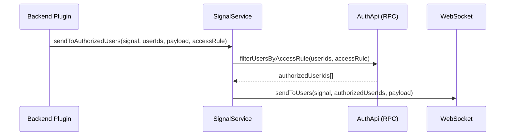
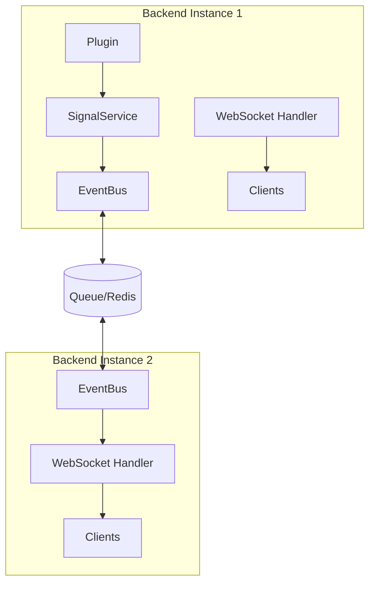

## Packages

| Package | Purpose |
|---------|---------|
| `@checkstack/signal-common` | Shared types, `Signal` interface, `createSignal()` factory |
| `@checkstack/signal-backend` | `SignalServiceImpl`, WebSocket handler for Bun |
| `@checkstack/signal-frontend` | React `SignalProvider`, `useSignal()`, `useSubscribeAllSignals()` |
| `@checkstack/frontend` | `SignalAutoInvalidator` (mounted once near `QueryClientProvider`) |

---

## Defining Signals

Signals are defined in `-common` packages using `createSignal()`. The factory takes a single object: the plugin's `pluginMetadata`, an `event` name, and the Zod `payloadSchema`. The signal id is constructed automatically as `${pluginMetadata.pluginId}.${event}`, and the resulting `Signal` carries a `pluginId` field.

```typescript
import { createSignal } from "@checkstack/signal-common";
import { z } from "zod";
import { pluginMetadata } from "./plugin-metadata"; // pluginId: "notification"

export const NOTIFICATION_RECEIVED = createSignal({
  pluginMetadata,
  event: "received",
  payloadSchema: z.object({
    id: z.string(),
    title: z.string(),
    body: z.string(),
    importance: z.enum(["info", "warning", "critical"]),
  }),
});
// → { id: "notification.received", pluginId: "notification", payloadSchema: ... }
```

### Signal ID Naming Convention

The id is always `${pluginId}.${event}`, enforced by the factory. Use lower-snake / lower-dot for the event part:

- `notification.received`
- `notification.count_changed`
- `healthcheck.run.completed`
- `healthcheck.system.status_changed`
- `dependency.warnings.changed`

> **Don't hand-roll signal ids.** Always use `createSignal({...})`. The id and `pluginId` field are what the auto-invalidator routes on; off-convention ids would break invalidation silently.

### Framework-Level Signals

`@checkstack/signal-common` itself defines `PLUGIN_INSTALLED` and `PLUGIN_DEREGISTERED` under the synthetic pluginId `"core"`. No plugin may register itself with the `core` pluginId.

---

## Backend Usage

### Accessing SignalService

The `SignalService` is available via `coreServices`:

```typescript
import { coreServices } from "@checkstack/backend-api";

// In a plugin init
const signalService = await services.get(coreServices.signalService);
```

### Emitting Signals

The broadcast / sendToUser / sendToUsers / sendToAuthorizedUsers methods all read `signal.pluginId` and put it on the wire envelope automatically. Plugin code does not need to think about it.

#### Broadcast (All Clients)

```typescript
import { SYSTEM_MAINTENANCE } from "@checkstack/system-common";

// All connected clients receive this
await signalService.broadcast(SYSTEM_MAINTENANCE, {
  message: "System maintenance in 5 minutes",
  scheduledAt: new Date().toISOString(),
});
```

#### To Specific User

```typescript
import { NOTIFICATION_RECEIVED } from "@checkstack/notification-common";

// Only this user's connections receive it
await signalService.sendToUser(NOTIFICATION_RECEIVED, userId, {
  id: notificationId,
  title: "New message",
  body: "You have a new notification",
  importance: "info",
});
```

#### To Multiple Users

```typescript
await signalService.sendToUsers(NOTIFICATION_RECEIVED, [user1, user2], {
  id: notificationId,
  title: "Team alert",
  body: "Important update for the team",
  importance: "warning",
});
```

#### To Authorized Users Only (Access-Based)

For sensitive signals that should only reach users with specific access rules:



```typescript
import { pluginMetadata, access, HEALTH_STATE_CHANGED } from "@checkstack/healthcheck-common";

// Only users with the access rule receive the signal
await signalService.sendToAuthorizedUsers(
  HEALTH_STATE_CHANGED,
  subscriberUserIds,
  { systemId, newState: "degraded" },
  pluginMetadata,
  access.healthcheckStatusRead
);
```

> **Note**: This method uses S2S RPC to filter users via the `auth` plugin's `filterUsersByAccessRule` endpoint. Users with the `admin` role receive the signal because all access rules are synced to the admin role.

---

## Frontend Usage

### SignalProvider + SignalAutoInvalidator

`SignalProvider` opens a single shared WebSocket; `SignalAutoInvalidator` is mounted once inside it (and inside `QueryClientProvider`). The auto-invalidator subscribes to **every** incoming signal and invalidates `[[pluginId]]` on the React Query client. Both are wired in `core/frontend/src/App.tsx` and you should not need to change them.

```tsx
// core/frontend/src/App.tsx (excerpt)
<QueryClientProvider client={queryClient}>
  <ApiProvider registry={apiRegistry}>
    <OrpcQueryProvider>
      <SessionProvider>
        <SignalProvider backendUrl={baseUrl}>
          <SignalAutoInvalidator />
          {/* ...rest of app */}
        </SignalProvider>
      </SessionProvider>
    </OrpcQueryProvider>
  </ApiProvider>
</QueryClientProvider>
```

### Default behaviour: do nothing

For typical "I want my data to update when something changes" cases, plugin code does **not** need to subscribe to signals. Just write a normal `useQuery`:

```tsx
const { data } = anomalyClient.getAnomalies.useQuery({ systemId });
```

When the backend broadcasts `anomaly.state_changed`, the auto-invalidator will invalidate every query keyed `[["anomaly"]]`, and React Query refetches whatever is currently mounted. No `useSignal` call needed.

### Cross-plugin reactivity: `foreignSignals`

Sometimes one plugin's data depends on another plugin's signal. The classic example is the dependency map: dependency queries embed system health, so they must refetch when `healthcheck.system.status_changed` fires. Declare this on the plugin:

```tsx
// core/dependency-frontend/src/index.tsx
import { createFrontendPlugin } from "@checkstack/frontend-api";
import { pluginMetadata } from "@checkstack/dependency-common";
import { SYSTEM_STATUS_CHANGED } from "@checkstack/healthcheck-common";

export default createFrontendPlugin({
  metadata: pluginMetadata, // pluginId: "dependency"

  // SYSTEM_STATUS_CHANGED is owned by `healthcheck`. Listing it here means
  // [["dependency"]] queries will ALSO be invalidated when it fires.
  // Same-plugin signals (DEPENDENCY_*) must NOT be listed — they are
  // auto-invalidated already.
  foreignSignals: [SYSTEM_STATUS_CHANGED],

  // ...routes, extensions, apis
});
```

Rules:
- **Pass actual `Signal` objects, not strings.** This stays type-safe through refactors.
- **Do not list your own signals.** They are auto-invalidated; listing them here would no-op (still gets invalidated once) but adds noise.
- **Use only when needed.** If your plugin's queries don't embed another plugin's data, you don't need `foreignSignals`.

`foreignSignals` declarations are picked up immediately when a plugin is registered — including dynamically-loaded plugins via `PLUGIN_INSTALLED`.

### `useSignal` — for genuine UI state, not for refetching

`useSignal` still exists, but use it only when you need to do **something other than invalidate a query**. Concretely:
- Append to an in-memory event log (e.g. dashboard activity terminal).
- Update transient UI state that is not derivable from a query.
- Trigger a side effect (toast, animation, scroll).

```tsx
import { useSignal } from "@checkstack/signal-frontend";
import { HEALTH_CHECK_RUN_COMPLETED } from "@checkstack/healthcheck-common";

useSignal(HEALTH_CHECK_RUN_COMPLETED, ({ systemName, status, latencyMs }) => {
  // Append to local terminal feed — not derivable from cache
  setTerminalEntries((prev) => [
    { systemName, status, latencyMs, timestamp: new Date() },
    ...prev,
  ].slice(0, MAX_ENTRIES));
});
```

> **If your handler body is just `refetch()` or `queryClient.invalidateQueries(...)`, delete the handler.** The auto-invalidator already does it.

### `useSubscribeAllSignals` — for advanced wildcard subscriptions

`useSubscribeAllSignals` fires for every incoming signal with `{ signalId, pluginId, payload }`. It's used by `SignalAutoInvalidator` itself and is exported for niche cases (e.g. an admin debug page that prints every signal). Avoid it in normal plugin code.

### useSignalConnection Hook

Check connection status:

```tsx
import { useSignalConnection } from "@checkstack/signal-frontend";

function ConnectionIndicator() {
  const { isConnected } = useSignalConnection();
  return (
    <div className={isConnected ? "text-green-500" : "text-red-500"}>
      {isConnected ? "Connected" : "Disconnected"}
    </div>
  );
}
```

---

## WebSocket Protocol

### Endpoint

```
ws://{backend-url}/api/signals/ws
```

### Authentication

- **Anonymous connections allowed** — receive broadcast signals
- **Authenticated connections** — receive broadcasts + private user channel
- Authentication uses the session cookie (same as HTTP requests)

### Message Types

#### Server → Client

| Type | Description |
|------|-------------|
| `connected` | Connection confirmed, includes `userId` if authenticated |
| `signal` | Signal payload — `signalId`, `pluginId`, `payload`, `timestamp` |
| `pong` | Response to client ping |
| `error` | Error message |

#### Client → Server

| Type | Description |
|------|-------------|
| `ping` | Keepalive ping |

### Example Messages

```json
// Server: Connection confirmed
{ "type": "connected", "userId": "user-123" }

// Server: Signal received — note the explicit pluginId field
{
  "type": "signal",
  "signalId": "notification.received",
  "pluginId": "notification",
  "payload": { "id": "n-1", "title": "Hello" },
  "timestamp": "2024-01-15T12:00:00Z"
}
```

---

## Multi-Instance Coordination

The Signal Service uses the EventBus for coordination across backend instances:



When a signal is emitted:
1. `SignalService.sendToUser()` emits to EventBus
2. EventBus broadcasts via the queue system
3. All backend instances receive the event
4. Each instance's WebSocket handler publishes to local clients

---

## Channel Architecture

Bun's native pub/sub is used for efficient routing:

| Channel | Pattern | Purpose |
|---------|---------|---------|
| `signals:broadcast` | All clients subscribe | System-wide announcements |
| `signals:user:{userId}` | Per-user subscription | Private notifications |

---

## Best Practices

### 1. Define Signals in Common Packages

Keep signal definitions in the `-common` package so both backend and frontend can import them:

```
core/notification-common/src/signals.ts   # Define here
core/notification-backend/src/service.ts  # Emit here
core/notification-frontend/src/...        # Consume only if you need UI side-effects
```

### 2. Trust the auto-invalidator

For "data should refresh when X changes" cases, just keep the relevant signals firing on the backend and write normal queries on the frontend. Do not add `useSignal` handlers that only call `refetch()` or `queryClient.invalidateQueries(...)` — they are noise that the auto-invalidator covers automatically.

### 3. Use Specific Signal Types

Prefer multiple specific signals over one generic signal:

```typescript
// ✅ Good
const NOTIFICATION_RECEIVED = createSignal({ pluginMetadata, event: "received", payloadSchema: ... });
const NOTIFICATION_READ     = createSignal({ pluginMetadata, event: "read",     payloadSchema: ... });

// ❌ Avoid
const NOTIFICATION_EVENT = createSignal({
  pluginMetadata,
  event: "event",
  payloadSchema: z.object({ type: z.enum(["received", "read"]), ... }),
});
```

### 4. Use `foreignSignals` sparingly

If your plugin's `[[pluginId]]` queries truly embed data owned by another plugin (e.g. dependency map embedding system health), declare a `foreignSignals` entry. Don't use it as a hammer — most of the time, each plugin's data is independent.

### 5. Emit Signals Asynchronously

Use `void` to emit signals without blocking:

```typescript
if (signalService) {
  void signalService.sendToUser(NOTIFICATION_RECEIVED, userId, payload);
}
```

---

## Configuration

### Backend

No additional configuration required. The WebSocket server runs on the same port as HTTP.

### Frontend

Set `VITE_API_BASE_URL` environment variable:

```env
VITE_API_BASE_URL=http://localhost:3000
```

---

## Debugging

### Backend Logs

Set log level to `debug` to see signal emissions:

```
DEBUG Sending signal notification.received to user user-123
DEBUG Relayed signal notification.received to user user-123
```

### Frontend Console

- Network tab → WS filter → `/api/signals/ws` to inspect the WebSocket frames (each `signal` message includes `signalId` and `pluginId`).
- React Query Devtools → watch the `[[pluginId]]` queries flip to "fetching" the moment a signal arrives.

---

## Migration: Removing Per-Component Signal Handlers

Before this architecture, components manually subscribed to signals just to invalidate their cache:

```tsx
// ❌ Before — pure cache invalidation, redundant
const { data, refetch } = client.getThing.useQuery({ systemId });
useSignal(THING_CHANGED, ({ systemIds }) => {
  if (systemIds.includes(systemId)) void refetch();
});
```

```tsx
// ✅ After — auto-invalidator handles it
const { data } = client.getThing.useQuery({ systemId });
```

If you find a `useSignal` handler whose body is only a `refetch()` or `queryClient.invalidateQueries(...)`, delete it. If the signal is owned by a different plugin than the query you want to refresh, add it to `foreignSignals` on your plugin instead.

---

## API Reference

### signal-common

```typescript
// Create a typed signal — id is always `${pluginId}.${event}`
function createSignal<T>(props: {
  pluginMetadata: PluginMetadata;
  event: string;
  payloadSchema: z.ZodType<T>;
}): Signal<T>

// Signal interface
interface Signal<T> {
  id: string;
  pluginId: string;
  payloadSchema: z.ZodType<T>;
}

// Wire envelope
interface SignalMessage<T> {
  signalId: string;
  pluginId: string;
  payload: T;
  timestamp: string;
}

// SignalService interface
interface SignalService {
  broadcast<T>(signal: Signal<T>, payload: T): Promise<void>;
  sendToUser<T>(signal: Signal<T>, userId: string, payload: T): Promise<void>;
  sendToUsers<T>(signal: Signal<T>, userIds: string[], payload: T): Promise<void>;
  sendToAuthorizedUsers<T>(
    signal: Signal<T>,
    userIds: string[],
    payload: T,
    pluginMetadata: PluginMetadata,
    accessRule: AccessRule,
  ): Promise<void>;
}
```

### signal-frontend

```typescript
// Provider component (mounts the WebSocket)
function SignalProvider(props: {
  children: React.ReactNode;
  backendUrl?: string;
}): JSX.Element;

// Subscribe to a single typed signal — use ONLY for non-cache UI side-effects.
function useSignal<T>(
  signal: Signal<T>,
  callback: (payload: T) => void,
): void;

// Subscribe to ALL incoming signals (advanced; used by the auto-invalidator).
type SignalAllCallback = (props: {
  signalId: string;
  pluginId: string;
  payload: unknown;
}) => void;

function useSubscribeAllSignals(callback: SignalAllCallback): void;

// Connection status
function useSignalConnection(): { isConnected: boolean };
```

### frontend-api

```typescript
// Plugin definition gains a foreignSignals field
interface FrontendPlugin {
  metadata: PluginMetadata;
  apis?: ApiFactory<unknown>[];
  extensions?: Extension[];
  routes?: PluginRoute[];

  /**
   * Foreign signals that should ALSO invalidate this plugin's [[pluginId]]
   * cache when received. Same-plugin signals are auto-invalidated and must
   * NOT be listed here.
   */
  foreignSignals?: Signal<unknown>[];
}
```

---

## Related Documentation

- [Queue System](/checkstack/developer-guide/backend/queue-system/) - EventBus and multi-instance coordination
- [Backend Plugins](/checkstack/developer-guide/backend/plugins/) - Plugin architecture
- [Frontend Plugins](/checkstack/developer-guide/frontend/plugins/) - React integration patterns
