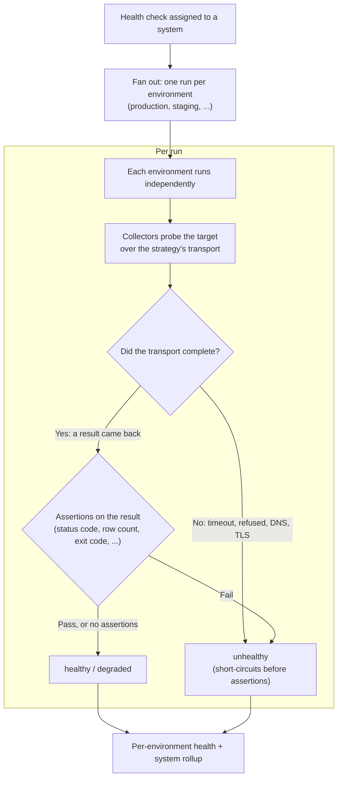

A health check is a scheduled probe that asks "is this system OK right now?" Health checks are the source of every healthy or unhealthy reading you see in the UI, every state-change notification, and every long-term availability chart. This page covers the everyday concepts; for authoring custom checks see the [Developer Guide](/checkstack/developer-guide/backend/healthchecks/strategies/).

## The basics

A health check is made of:

- A **strategy** that defines how to connect to the target (HTTP, SSH, PostgreSQL, Redis, DNS, Ping, TCP, TLS, ...).
- A **configuration** that tells the strategy where and how to connect (URL, port, query, credentials).
- An **interval** in seconds. Every interval the platform runs the check on every system it is attached to.
- A set of **systems** it runs against. The same check definition can be reused for many systems; in the UI you assign it to systems individually, by group, or via templates.

> [!TIP]
> When a connection field is sensitive (password, private key, token), the strategy marks it as a secret. Checkstack encrypts it at rest using your `ENCRYPTION_MASTER_KEY` and masks it in the UI. See [Secret encryption](/checkstack/user-guide/reference/secret-encryption/).

## Assignments

A check configuration on its own does nothing. It starts running only once you
**assign** it to a system. An **assignment** is the link row between one check
configuration and one system, and creating it is what schedules the check:
until a check is assigned, the scheduler has nothing to fire.

The assignment is also where per-system behaviour lives. Two systems can share
the same check configuration while each tunes its own copy. An assignment
carries:

- **State thresholds** for this system: how many failures flip it to degraded
  or unhealthy (see [Results, states, and thresholds](#results-states-and-thresholds)).
- **Retention** overrides for how long this system's runs are kept.
- **Anomaly detection** toggles for this system's metrics.
- The **per-environment fan-out** (the **Execution** panel): which environments
  the check runs against on this system.

> [!IMPORTANT]
> You do **not** clone a system per environment to monitor staging and
> production. One system attaches to many [Environments](/checkstack/user-guide/concepts/environments/),
> and a single assignment fans out into one run per environment. See
> [Per-environment fan-out](/checkstack/user-guide/concepts/environments/#per-environment-fan-out).

You manage assignments from the **System detail page** (attach a check to this
system) or from a check's editor (the **Assignments** section lists every
system it runs against). The hands-on
[Set up your first health check](/checkstack/user-guide/guides/first-health-check/)
walks through creating one.

## Strategies vs collectors

You may see two related terms in the UI: strategies and collectors.

- A **strategy** establishes a transport-level connection. The SSH strategy gets you a shell on a host; the PostgreSQL strategy opens a SQL session; the HTTP strategy makes an HTTP request.
- A **collector** runs on top of a strategy's connection and produces a specific kind of data. An SSH strategy can host CPU, memory, and disk collectors that each run their own commands and parse the output.

For most checks you only ever see strategies. Collectors come into play when a single transport (typically SSH) is used to gather many independent metrics. You configure which collectors run on the same form as the strategy.

> [!NOTE]
> Strategies and collectors are both implemented as plugins. If you do not see the strategy you need (for example, gRPC or RCON), check the Plugin Manager for an off-the-shelf plugin before writing a custom one.

### HTTP egress safety

When the HTTP strategy runs on the core (rather than on a satellite), it applies a secure-by-default egress guard. It resolves the target host to its IP and refuses to connect to the cloud-metadata and link-local ranges (`169.254.0.0/16`, the IPv6 link-local and unique-local ranges that cover `fd00:ec2::254`, and similar), so a check cannot be pointed at `http://169.254.169.254/...` to read instance credentials. The connection is pinned to the validated IP to resist DNS-rebind.

Internal and private-network targets (RFC1918, your own VPC) remain allowed by default, because probing internal services is a normal monitoring job. Operators who want to block additional ranges can list extra CIDRs in the HTTP strategy config's `egressDenyCidrs`; those are added on top of the always-on metadata/link-local block.

## Scheduling

The platform schedules each check independently. A check with `intervalSeconds: 60` runs once per minute on every system it is attached to. There is no fancy distributed cron: the backend keeps an internal scheduler that fires queue jobs at the right time.

If you need a check to run from another network, attach **satellites** to it. Each satellite executes the check on its side and ships results back. You can also keep running the check locally at the same time (the `includeLocal` toggle in the editor). See [Satellites](/checkstack/user-guide/concepts/satellites/).

A check also **fans out into one run per environment** the system belongs to, so a single check covers staging and production without duplication. You pick the environment set per assignment (All / Specific / None) in the **Execution** panel, and each run is stored with its own `environmentId`. See [Environments](/checkstack/user-guide/concepts/environments/) for the fan-out model and run identity.

> [!TIP]
> Picking the right interval is a trade-off. Faster checks catch incidents sooner; slower checks generate less load and noise. 30 to 60 seconds is a good default. For checks that are expensive (large SQL queries, slow third-party APIs) consider 5 minutes or more.

## Results, states, and thresholds

Every run of a check produces a result. The platform reduces each result to one of three **states**:

- **healthy**: the check is operating normally.
- **degraded**: the check is producing partial or warning-level output.
- **unhealthy**: the check is failing.

A single failed run does not immediately mark a system unhealthy. Checkstack uses **state thresholds** to debounce noisy probes. The defaults work for most setups:

| State | Default rule |
|-------|---------------|
| healthy | Becomes healthy after 1 consecutive success. |
| degraded | Becomes degraded after 2 consecutive failures. |
| unhealthy | Becomes unhealthy after 5 consecutive failures. |

You can override thresholds per (system, check) pair if a specific assignment is more or less sensitive than the default. A "window-based" threshold mode is also available, for cases where you want to react to "X failures in the last N runs" rather than "X consecutive failures".

> [!IMPORTANT]
> Thresholds apply to state transitions, not to the underlying runs. Every run is still stored, so latency charts and detailed history are unaffected by debouncing.

## Anomaly detection

For numeric metrics inside a check's result (latency, error rate, queue depth, ...), Checkstack can flag anomalies even when the overall state is still "healthy". An anomaly is a metric reading that drifts outside its expected range based on recent history.

Anomalies generate their own notifications and show up on system detail pages, but they do not change a system's health state. They are designed to surface "this is weird, look at it" signals before they become outright failures.

> [!NOTE]
> Anomaly detection is enabled per check assignment. You will see an Anomaly Detection card on the health-check configuration page if the strategy exposes metrics that support it.

## Assertion analytics

Assertions do not just pass or fail a single run; Checkstack tracks each
assertion over time so you can see how a specific check has been behaving.

- On any run in the history, the **Assertions** tab lists every assertion the
  run evaluated, each with a pass or fail marker and the expected value next to
  the actual value the probe saw. Failing assertions are called out so you can
  tell at a glance why a run went unhealthy.
- In a check's drawer, each collector leads with a **pass-rate tile** per
  assertion. The tile shows the recent pass rate and a small trend, and expands
  to a timeline of passes and failures per time bucket, so a flaky assertion is
  obvious even when the overall state looks fine.
- Editing an assertion starts a fresh history series (the old one stops
  collecting), so a rate you are looking at always reflects the assertion as it
  is configured now. A series whose assertion was later removed still shows,
  marked as no longer configured.

> [!NOTE]
> Checks executed by [satellites](/checkstack/user-guide/concepts/satellites/)
> now enforce assertions too. The core grades a satellite's reported result
> against the check's assertions, so a satellite run that fails an assertion is
> marked unhealthy just like a locally executed one.

## Data retention

Raw check results add up quickly. Checkstack aggregates them on a tiered schedule so old data still fuels long-term charts without ballooning the database:

| Tier | Default retention |
|------|--------------------|
| Raw runs | 7 days |
| Hourly aggregates | 30 days |
| Daily aggregates | 365 days |

The retention pipeline runs in the background and is configurable per health-check assignment. See [Retention and limits](/checkstack/user-guide/reference/) (full reference) and the [data management developer doc](/checkstack/developer-guide/backend/healthchecks/data-management/) for the internals.

## Script health checks

If none of the bundled strategies fit, the **script health check** lets you write the probe as a small piece of code. You provide the script, Checkstack runs it on the schedule you set, and the script returns a result the platform can grade. This is the escape hatch for one-off checks that do not warrant a full plugin.

See [Script health checks](/checkstack/user-guide/reference/script-health-checks/) for the runtime contract and security model.

## From collection to status

This is the pipeline a single check goes through, from the assignment down to a
per-environment status. The two decision points are the important part: a
**transport failure** short-circuits straight to `unhealthy` before any
assertion runs, while a **completed** collection is graded by its assertions.



A result merely looking abnormal (an HTTP 404, a non-zero exit code, zero rows)
is a **completed** collection, not a transport failure. The collector records it
as a metric and the assertions decide whether that counts as healthy. Only the
probe failing to complete at all short-circuits to `unhealthy`. Each
environment's runs roll up into its own [per-environment health](/checkstack/user-guide/concepts/environments/#per-environment-health) plus the system-wide status.

## Secrets in check configuration

Credential fields (passwords, tokens, private keys) are secret fields: the
value you type is moved into the platform's encrypted secret store on save,
and it is never sent back to the browser - reopening the editor shows a blank
input, and leaving it blank keeps the stored value. To rotate a credential,
type the new value and save.

Instead of typing a value inline, you can reference a named secret from the
Secrets page with `${{ secrets.NAME }}` - useful when several checks share
one credential or when secrets are managed in Vault. References resolve at
run time; runs fail clearly when the referenced secret is missing.

## Asserting on JSON response bodies

Collectors that return a raw body (for example the HTTP strategy's Request
collector) expose a **Body (JSONPath)** assertion field. Enter a JSONPath
expression (like `$.status` or `$.data[0].id`), pick an operator, and the run
parses the body as JSON, extracts the value at that path, and grades it.

Useful patterns:

- **A key equals a value**: `$.status` with **Equals** `ok`.
- **No errors reported**: `$.errors` with **Is Empty** - passes for `[]`, `{}`,
  `""`, or a missing key.
- **A key exists but is empty**: two assertions on the same path - `$.error`
  **Exists** plus `$.error` **Is Empty**. `Is Empty` alone also passes when the
  key is missing entirely; the `Exists` pair pins the shape down.
- **A list has entries**: `$.items` with **Is Not Empty**, or assert on the
  count with `$.items.length` and **Greater Than** `0`.

> [!NOTE]
> A body that is not valid JSON fails the assertion (the run detail shows a
> diagnostic), not the collection itself. Filter expressions such as
> `$.items[?(@.x == 1)]` are rejected: they would evaluate user-authored code
> inside the platform, so only plain path expressions are supported.

## How a check moves through the system

A simplified view of one run:

```text
[scheduler] ----> queue job ----> [executor] ----> [strategy.connect()]
                                       |                  |
                                       |                  v
                                       |          [collector(s) run]
                                       v                  |
                              record HealthCheckRun <-----+
                                       |
                                       v
                          [state evaluator] applies thresholds
                                       |
                                       v
                       state transition? -> notify subscribers
                                       |
                                       v
                          [aggregation] rolls into hourly bucket
```

The notification step honours [Incident](/checkstack/user-guide/concepts/incidents/) and [Maintenance](/checkstack/user-guide/concepts/maintenances/) silencing for affected systems, so an already-reported outage does not flood the chat.

## UI tour

| Where to go | What you do there |
|-------------|-------------------|
| **Health Checks -> Configurations** | Create and edit check definitions. Pick a strategy, configure it, set the interval. |
| **System detail page** | Attach a check to a system, override thresholds, view latency and status charts. |
| **Health Checks -> Templates** | Save common configurations as templates to apply to many systems. |

## Where to go next

- **Hands-on.** Walk through [Set up your first health check](/checkstack/user-guide/guides/first-health-check/).
- **Custom logic.** Read [Script health checks](/checkstack/user-guide/reference/script-health-checks/) for the scripted escape hatch.
- **Remote execution.** See [Satellites](/checkstack/user-guide/concepts/satellites/) when you need to monitor from elsewhere.
- **Notifications.** Read [Notifications](/checkstack/user-guide/concepts/notifications/) to understand who hears about a state change.
