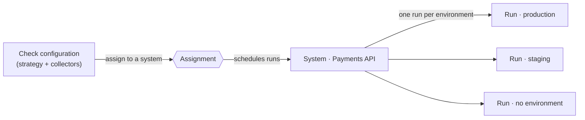

This walkthrough takes you from a fresh Checkstack install to a running HTTP health check returning live data. The HTTP strategy is the easiest to demo because it only needs a URL, but every other strategy follows the same flow.

## 1. Open the dashboard

Sign in to Checkstack as a user with the `catalog.systems.manage` and `healthcheck.configuration.manage` access rules. Both rules are included in the built-in administrator role.

The first thing you see is the dashboard. Use the main sidebar to navigate; the guide below references its menu entries by name.

## 2. Create a system

A system is the unit of organisation in Checkstack: it groups one or more health checks, tracks an overall health status, and is the thing notifications and incidents reference. Read [Systems and groups](/checkstack/user-guide/concepts/systems-and-groups/) for the full mental model.

1. Open the **Catalog** page from the sidebar.
2. Click **Create System**.
3. Fill in the form:
   - **Name** - for example `Payments API`.
   - **Description** - optional, one or two sentences describing what the system does.
4. Click **Create**.

The new system appears in the catalog with status `unknown`. It stays in `unknown` until the first health check returns a result.

> [!TIP]
> Need prod **and** staging? Do not clone the system. Attach
> [Environments](/checkstack/user-guide/concepts/environments/) to the one
> system instead, and a single assignment runs the check once per environment.
> One system, many environments - never one system per environment.

## 3. Start the health check wizard

1. Open the **Health Checks** page from the sidebar.
2. Click **Create Check** in the top-right corner.

You land on the Strategy Picker, a grid of every strategy installed on this instance grouped by category (Network, HTTP, Database, Script, and so on). Hover any card to see its description; use the search box if the list is long.

> [!TIP]
> The strategies in the picker come from installed plugins. If you do not see a strategy you need, install the corresponding plugin from the [Plugin Manager](/checkstack/user-guide/guides/install-a-plugin/) and refresh.

## 4. Pick the HTTP strategy

Click the **HTTP Health Check** card. The platform navigates to the Health Check editor with the HTTP strategy preselected.

## 5. Configure the check

The editor is a split-pane IDE. The left tree lists the editable sections (General, Strategy, Collectors). Walk through each one:

### General

- **Name** - a friendly label, for example `Payments API root`.
- **Interval (seconds)** - how often the check runs. `60` is a sensible starting value; the platform enforces a minimum.

### Strategy

The HTTP strategy itself only requires global request defaults; the actual URL lives on a collector. Leave the defaults unless you have specific timeout requirements.

If the endpoint requires authentication, pick a scheme in the **Authentication** dropdown:

- **none** (default) - no `Authorization` header is sent.
- **basic** - enter a username and password; requests carry `Authorization: Basic <base64(username:password)>`.
- **token** - enter a token; requests carry `Authorization: Bearer <token>`.

Passwords and tokens are secret fields: they are stored encrypted and redacted in the UI. A collector that sets its own `Authorization` header takes precedence over the strategy-level setting.

### Collectors

The HTTP strategy ships with a built-in **Request collector**. Add it from the **Add Collector** menu, then configure:

- **URL** - the endpoint to call, for example `https://api.example.com/healthz`.
- **Method** - `GET` for most health checks.
- **Expected status** - `200` (or a list, for example `200, 204`).
- **Timeout** - the HTTP timeout. Defaults work for most cases.

> [!NOTE]
> The collector exposes additional fields (headers, body, expected response body) that are useful for protected endpoints or strict contract checks. See the in-editor help text for each field.

## 6. Attach the check to your system

The editor tree shows an **Assignment** section with a **Systems** node listing the systems this check will apply to.

> [!NOTE]
> **What is an assignment, and why does a check need one?**
>
> An assignment is the link row between this check configuration and a system.
> The check does **not** run until it is assigned - creating the assignment is
> what schedules it. The assignment also carries this system's overrides: its
> state thresholds, its retention, and the **per-environment fan-out** (one run
> per environment the system belongs to). See
> [Assignments](/checkstack/user-guide/concepts/health-checks/#assignments) for
> the full model.

1. Select the **Systems** node in the tree.
2. Tick the `Payments API` system you created in step 2.

Per-system settings (state thresholds, environment fan-out, notifications, retention) are tuned after saving, in the saved check's **Assignment** section. The threshold defaults are 1 failure to mark degraded, 3 failures to mark unhealthy.

## 7. Save

Click **Save** in the top-right corner. The editor validates the config, persists it, creates the assignment, and schedules the first run. You land in the saved check's editor, where the **Assignment** section now lists `Payments API` with its per-system panels.

## 8. Watch the first result

The first execution kicks off within a few seconds:

1. Open the **Catalog** and click into the `Payments API` system.
2. The system detail page shows the new health check with status `running` briefly, then `healthy` or `unhealthy` once the first run completes.
3. Click the check name to see the run history, a latency chart, and per-collector charts.

If the result is unhealthy, the detail panel surfaces the error message returned by the collector (HTTP status, timeout, connection refused, and so on).

## 9. Iterate

From here you can:

- Add more collectors to the same check to assert response body content, certificate expiry, or custom headers.
- Add more checks to the system - for example a Postgres connectivity check from the same plugin family.
- Schedule the check to a remote vantage point by attaching a satellite. See [Connect a satellite](/checkstack/user-guide/guides/connect-a-satellite/).
- Suppress notifications for known disruptions. See [Silence alerts](/checkstack/user-guide/guides/silence-alerts/).

> [!IMPORTANT]
> Failing health checks do NOT auto-open incidents. They flip the system status, burn SLO error budget, and notify subscribers, but the incident timeline is reported by hand. See [Open and resolve an incident](/checkstack/user-guide/guides/open-and-resolve-incident/).

## See also

- [Health checks](/checkstack/user-guide/concepts/health-checks/) - the underlying model.
- [Script health checks](/checkstack/user-guide/reference/script-health-checks/) - reach for these when no built-in strategy fits.
- [Health check strategies (developer)](/checkstack/developer-guide/backend/healthchecks/strategies/) - build your own strategy as a plugin.
